## 1. 简介

### 1.1. 概述

> 消息队列简称 MQ，英文全称为 `Message Queue`，它是一种跨进程的通信机制，用于上下游传递消息。采取典型的生产者和消费者模型，生产者不断的向队列中发送消息，消费者不断的从队列中获取消息。

MQ 的优点：

- 任务**异步处理**

  在项目中，可将一些**无需即时返回且耗时**的操作提取出来，进行**异步处理**，而这种异步处理的方式大大的节省了服务器的请求响应时间，从而**提高了系统的吞吐量**。此时MQ 就类似于一个中转站，使得消息的发送和接收可以异步进行，而生产者无需同步等待消费者及时返回。

  比如在商品购物业务中，用户支付完之后 ，支付业务直接将消息投递到 MQ 中，就直接可以返回用户结果，而无需再同步等待订单服务、短信服务等模块的响应，实现了任务的异步处理，从而实现了异步通信。

  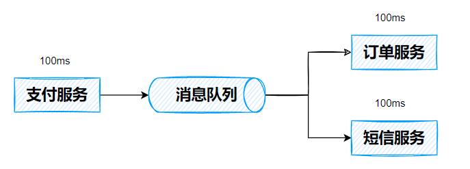

- 应用程序**解耦合**

  MQ 相当于一个中介，生产者只需要将消息投递到 MQ中，而无需直接调用消费者模块的相关接口，消费者只需要监听 MQ 即可，从而实现应用程序的解耦合。并且如果之后需要增加一些业务需求，无需改变生产者代码，只需让新的业务监听 MQ 消息即可。

  比如在商品购物业务中，需要增加积分服务，那么只需要写完积分服务代码后，让其监听 MQ 即可，不需要再修改支付服务的代码，从而实现了解耦。而如果积分服务挂了，但并不会影响支付服务，从而实现了**故障隔离**（如果是同步调用，那么一个挂了，则相当于所有都挂了，消息队列机制则不会。）

  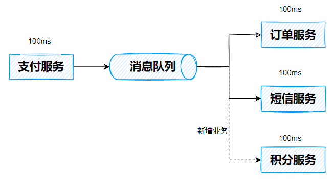

- **削峰填谷**

  如果一时间有大量的消息涌入，使用 MQ 可以应对**生产者的流量冲击**(类似于流量控制)，消费者只需要按照自己的处理能力对消息进行处理即可。

  比如在双十一秒杀时，有大量的订单消息，如果不对流量进行控制，那么订单服务可能会由于无法支撑那么大的并发量而挂掉。假设订单服务每秒只能处理10000次订单，而实际每秒有20000次订单，此时可以通过消息队列做一个缓冲作用，让订单服务分2秒处理掉这20000次订单。

  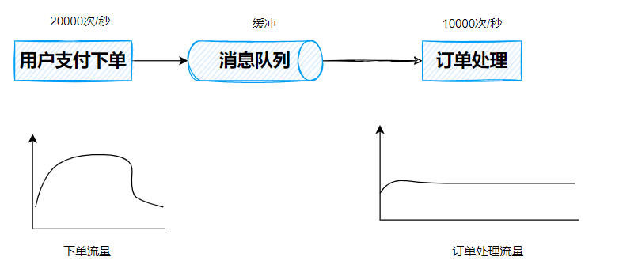

MQ 的缺点：

- **系统可用性降低**：系统依赖于MQ的可靠性、安全性、吞吐能力。比如若MQ宕机，整个系统都会崩溃。
- **数据链路复杂性增加**：本来生产者只需要直接将消息发送给消费者，而此时加入一个 MQ做中转，可能出现**消息丢失**，**消息的转发顺序改变**，**消息重复调用**等等问题。
- **数据一致性问题**：生产者发送消息需要MQ和消费者共同处理，如果MQ处理成功，而消费者处理失败，则可能会造成数据一致性问题。或者是多个消费者要处理修改同一条消息时，也可能会造成一致性问题。

### 1.2. AMQP 和 JMS

MQ 是消息通信的模型；实现 MQ 的大致有两种主流方式：AMQP、JMS。

 **AMQP**

AMQP 是一种协议，更准确的说是一种 binary wire-level protocol（链接协议）。这是其和 JMS 的本质差别，AMQP不从 API 层进行限定，而是直接定义网络交换的数据格式。

**JMS**

JMS 即 Java 消息服务（JavaMessage Service）应用程序接口，是一个 Java 平台中关于面向消息中间件（MOM）的API，用于在两个应用程序之间，或分布式系统中发送消息，进行异步通信。

 **AMQP 与 JMS 区别**

- JMS 是定义了统一的接口，来对消息操作进行统一；AMQP 是通过规定协议来统一数据交互的格式
- JMS 限定了必须使用Java语言；AMQP 只是协议，不规定实现方式，因此是跨语言的。
- JMS 规定了两种消息模式；而 AMQP 的消息模式更加丰富

### 1.3. 消息队列产品

市场上常见的消息队列有如下：

| 名称     | 开发语言         | 支持协议   | 可用性               | 单机吞吐量 | 消息延迟   | 可靠性 |
| -------- | ---------------- | ---------- | -------------------- | ---------- | ---------- | ------ |
| ActiveMQ | Java             | AMQP...    | 高（主从架构）       | 万级       | 毫秒级     | 一般   |
| RabbitMQ | Erlang（并发强） | AMQP       | 高（主从架构）       | 万级       | **微秒级** | **高** |
| RocketMQ | Java             | 自定义协议 | 非常高（分布式架构） | 十万级     | 毫秒级     | 高     |
| Kafka    | Scala            | 自定义协议 | 非常高（分布式架构） | 十万级     | 毫米级以内 | 一般   |

- RabbitMQ的可靠性高，消息延迟最低，社区活跃。
- Kafka的吞吐量极高，但可能会丢失数据，社区活跃。
- 如果是对可靠性要求较高的服务（如订单服务），可考虑使用 RabbitMQ/RocketMQ，如果对可靠性要求不太高、追求高吞吐量的服务（如日志服务），可考虑使用 Kafka。

### 1.4. RabbitMQ

> RabbitMQ 是由 erlang 语言开发，基于 AMQP（Advanced Message Queue 高级消息队列协议）协议实现的消息队列。官方地址：http://www.rabbitmq.com/

RabbitMQ 基本结构：

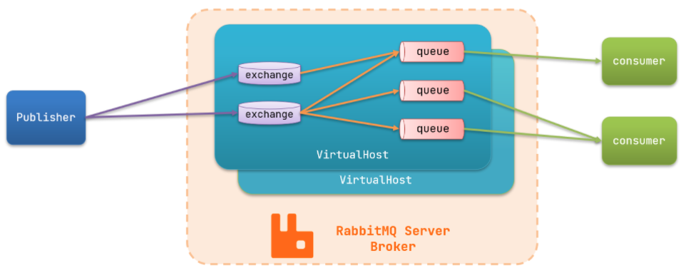

- `publisher`：生产者，负责产生消息
- `exchange`：交换机，负责路由消息到队列中
- `queue`：队列，负责缓存消息
- `virtual host`：虚拟主机，是对queue、exchange等资源的逻辑分组
- `consumer`：消费者，负责处理消息。

RabbitMQ 提供了 6 种模式：简单模式，work 模式，Publish/Subscribe 发布与订阅模式，Routing 路由模式，Topics主题模式，RPC 远程调用模式（远程调用，不太算MQ）；官网对应模式介绍：https://www.rabbitmq.com/getstarted.html

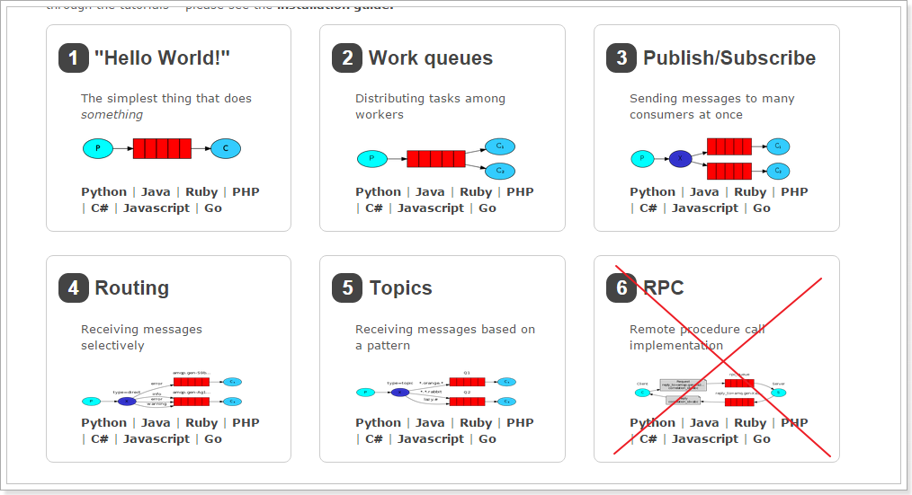

## 2. 安装

官方安装教程：https://www.rabbitmq.com/download.html

### 2.1 CentOS7 安装

**2.1.1 安装依赖环境**

~~~sh
yum install -y make gcc gcc-c++ m4 openssl openssl-devel ncurses-devel unixODBC unixODBC-devel java java-devel
~~~

**2.1.2  安装 Erlang**

注意 Erlang 和 RabbitMQ 需要版本对应，详情见https://www.rabbitmq.com/which-erlang.html

下载 Erlang，网址为 http://erlang.org/download/ ，比如下载 otp_src_23.3.tar.gz，然后通过 ftp 工具传输到 linux 服务器中，也可以使用 wget 命令在线下载（此文件下载非常慢）

~~~sh
wget http://erlang.org/download/otp_src_23.3.tar.gz # wget在线下载erlang
tar -zxvf otp_src_23.3.tar.gz  # 解压
cd otp_src_23.3 # 进入解压文件夹目录
./configure --prefix=/usr/local/erlang # 设置erlang的安装目录
make && make install  # 编译安装erlang
ll /usr/local/erlang/bin  # 检查erlang是否安装
echo 'export PATH=$PATH:/usr/local/erlang/bin' >> /etc/profile  # 将erlang添加到环境变量中
source /etc/profile # 刷新环境变量，使配置生效
erl  # 输入erl，若出现下面信息，则erlang安装和配置成功。注意：使用halt().退出
~~~

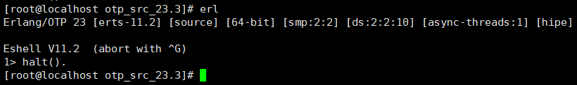

**2.1.3 安装 RabbitMQ**

下载 RabbitMQ，网址为https://www.rabbitmq.com/install-generic-unix.html#downloads，下载后通过 ftp 工具传输到 linux 服务器中，也可以使用 wget 命令在线下载

~~~sh
wget https://github.com/rabbitmq/rabbitmq-server/releases/download/v3.8.16/rabbitmq-server-generic-unix-3.8.16.tar.xz  # 下载RabbitMQ
tar -xvf rabbitmq-server-generic-unix-3.8.16.tar.xz # 解压
mv rabbitmq_server-3.8.16/ /usr/local/ # 将文件移动到/usr/local/目录下，其实可以直接解压到该目录。
echo 'export PATH=$PATH:/usr/local/rabbitmq_server-3.8.16/sbin' >> /etc/profile # 配置环境变量
source /etc/profile # 刷新环境变量，使配置生效
rabbitmq-plugins enable rabbitmq_management # 开启web管理插件，即开启管理界面
rabbitmq-server -detached # 启动mq
~~~

此时如果在浏览器输入http://ip:15672/就会看到web界面的登录界面，默认用户名密码均为guest，但如果此时我们登录，会遇到 User can only log in via localhost 这个问题。

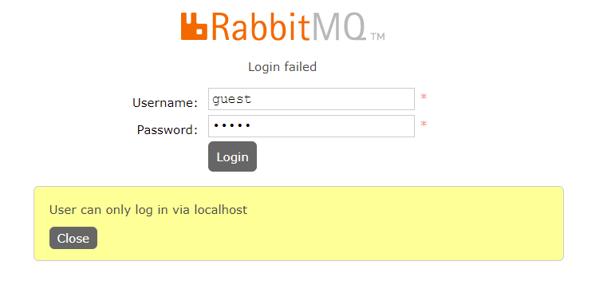

主要原因是 RabbitMQ 从 3.3.0 开始禁止使用 guest/guest 权限通过除 localhost 外的访问，所以我们需要进行一定配置，以使得其他主机也能访问此 RabbitMQ（注意开放端口15672，或者关闭防火墙 systemctl stop firewalld.service）

- <u>在3.8版本以前</u>，可以采取下面方法，然后就可以使用账号guest，密码guest进行登录了

  ~~~sh
  vim rabbitmq_server-3.7.8/ebin/rabbit.app 
  
  将：{loopback_users, [<<”guest”>>]}，
  改为：{loopback_users, [guest]}，
  ~~~

- <u>在3.8版本以后</u>，就不能使用上述方法了，因为都没有 rabbit.app 文件了，这个时候可以通过新添加一个用户账号来解决。

  ~~~sh
  rabbitmqctl list_users # 查看所有用户
  rabbitmqctl add_user zhang 123 # 新增加一个用户zhang，密码为123
  rabbitmqctl set_user_tags zhang administrator # 设置用户zhang的标签为管理员
  rabbitmqctl set_permissions -p "/" zhang ".*" ".*" ".*" # 配置用户zhang的权限，指定允许访问的vhost以及write/read，该命令使用户user_admin具有/vhost1这个virtual host中所有资源的配置、写、读权限以便管理其中的资源
  rabbitmqctl list_user_permissions zhang # 查看用户zhang的权限
  ~~~

  当配置好新用户后，就可以使用新用户的账号和密码进行管理界面的登录了，不需要重启服务

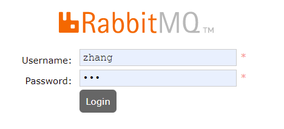

RabbitMQ 的其他命令

~~~sh
rabbitmq-server -detached # 启动服务,rabbitmq-server start也可以启动，但并木有后台运行
rabbitmqctl stop # 停止服务
~~~

### 2.2 Docker 安装

1. 拉取 RabbitMQ 镜像（其中标签带 management 的，表示启动 Rabbitmq 后可以打开 web 管理界面，否则不行）

   ~~~sh
   sudo docker pull rabbitmq:3.8.15-management
   ~~~

2. 查看镜像

   ~~~sh
   sudo docker images
   ~~~

3. 创建挂载（映射）目录（文件夹路径可自己选，后面对应上就行）

   ~~~sh
   mkdir -p /home/zhang/rabbitmq
   ~~~

4. 创建容器 rabbitmq

   ~~~sh
   sudo docker run -d --name rabbitmq  --hostname mq1 -p 5672:5672 -p 15672:15672 -v /home/zhang/rabbitmq:/var/lib/rabbitmq -h myRabbit -e RABBITMQ_DEFAULT_USER=admin -e RABBITMQ_DEFAULT_PASS=admin rabbitmq:3.8.15-management
   # -p 5672:5672 -p 15672:15672：端口映射，（5672：应用访问端口；15672：控制台Web端口号）
   # --name：容器名
   # --hostname：设置主机名，注意用于集群部署时使用
   # -v：映射目录，前表示主机部分，：后表示容器部分。
   # -h 主机名（RabbitMQ的一个重要注意事项是它根据所谓的 “节点名称” 存储数据，默认为主机名）
   # -d：容器后台运行
   # -e 指定环境变量：RABBITMQ_DEFAULT_USER：默认的用户名；RABBITMQ_DEFAULT_PASS：默认用户名的密码）
   ~~~

5. 浏览器输入`http://ip:15672`即可访问 Rabbitmq 的 web 管理页面，用户名密码是-e参数所指定的用户名和密码。

## 3. Java 操作 RabbitMQ

创建一个 maven 项目，并添加 rabbitmq 的依赖。

~~~xml
<dependencies>
    <!-- https://mvnrepository.com/artifact/com.rabbitmq/amqp-client -->
    <!--rabbitmq java 客户端-->
    <dependency>
        <groupId>com.rabbitmq</groupId>
        <artifactId>amqp-client</artifactId>
        <version>5.11.0</version>
    </dependency>
</dependencies>
~~~

### 3.1. Hello World

RabbitMQ 是消息代理：它接受并转发消息。可以将其视为邮局，将要发布的邮件放在邮箱中时，而邮局可以确保最终将邮件传递给相应收件人。

下面是 RabbitMQ 最简单的一种模式，“ P”表示生产者，“ C”是表示消费者。中间的框是一个队列 Queue，即保留的消息缓冲区。

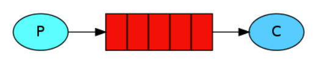

- *生产*仅意味着发送。发送消息的程序是*生产者*：
- *消费*与接收具有相似的含义。一个*消费者*是一个程序，主要是等待接收信息：
- *队列*是 RabbitMQ 内部的邮政信箱的名称。尽管消息流经 RabbitMQ，但它只能存储在*队列中*。*队列*仅由主机的存储器＆磁盘限制约束，它本质上是一个大的消息缓冲器。许多*生产者*可以发送进入一个队列的消息，许多*消费者*可以尝试从一个*队列*接收数据。

下面将将用Java编写两个程序。一个是生产者，用于发送消息；一个是消费者，用于接收消息。

**3.1.1. 编写生产者代码**

创建一个类 com.tju.producer.Producer_HelloWorld

~~~java
public class Producer_HelloWorld {
    public static void main(String[] args) throws IOException,TimeoutException {
        // 1. 创建工厂
        ConnectionFactory factory = new ConnectionFactory();
        // 2. 设置参数
        factory.setHost("127.0.0.1");  // ip,默认值"localhost"
        factory.setPort(5672); // 端口，默认值5672
        factory.setVirtualHost("tju_virtual"); // 虚拟机，默认值"/"
        factory.setUsername("zhang");  // 用户名，默认值guest
        factory.setPassword("123");  // 密码，默认值guest
        // 3. 创建连接 Connection
        Connection connection = factory.newConnection();
        // 4. 创建 Channel
        Channel channel = connection.createChannel();
        // 5. 创建队列 Queue
        /*
            参数1：队列名称(如果没有，则会自动创建)
            参数二：是否持久化
            参数三：是否独占，只能有一个消费者监听队列
            参数四：是否自动删除（当没有消费者时）
            参数五：一些其他参数设置
         */
        channel.queueDeclare("hello", false, false, false, null);
        // 6. 发送消息
        String message = "Hello  World!";
        /*
            参数1：交换机名称，简单模式下交换机会使用默认的""，设置为空字符串即可
            参数2：路由key名称
            参数3：配置信息
            参数4：真实发送的消息数据（字节数组的形式byte[]）
         */
        channel.basicPublish("", "hello", null, message.getBytes(StandardCharsets.UTF_8));
        System.out.println(" [x] Sent '" + message + "'");

        // 7. 释放资源
        channel.close();
        connection.close();
    }
}
~~~

**3.1.2. 编写消费者代码**

创建一个类 com.tjuconsumer.consumer_HelloWorld

~~~java
public class Consumer_HelloWorld {
    public static void main(String[] args) throws IOException, TimeoutException {
        // 1. 创建工厂
        ConnectionFactory factory = new ConnectionFactory();
        // 2. 设置参数
        factory.setHost("127.0.0.1");  // ip,默认值"localhost"
        factory.setPort(5672); // 端口，默认值5672
        factory.setVirtualHost("tju_virtual"); // 虚拟机，默认值"/"
        factory.setUsername("zhang");  // 用户名，默认值guest
        factory.setPassword("123");  // 密码，默认值guest
        // 3. 创建连接 Connection
        Connection connection = factory.newConnection();
        // 4. 创建 Channel
        Channel channel = connection.createChannel();
        // 5. 创建队列 Queue（其实如果队列已经被生产者创建后，就无需再创建,但由于可能不知道生产者消费者的执行顺序，所以就双方都建立，避免队列不存在）
        /*
            参数1：队列名称(如果没有，则会自动创建)
            参数二：是否持久化
            参数三：是否独占，只能有一个消费者监听队列
            参数四：是否自动删除（当没有消费者时）
            参数五：一些其他参数设置
         */
        channel.queueDeclare("hello", false, false, false, null);
        System.out.println(" [*] Waiting for messages. To exit press CTRL+C");

        // 6. 接收消息
        Consumer consumer = new DefaultConsumer(channel){
            /**
             * 回调方法，当收到消息后，会自动执行该方法
             * @param consumerTag 标识
             * @param envelope 获取一些信息（比如交换机，路由key...）
             * @param properties 配置信息
             * @param body 真实数据
             * @throws IOException
             */
            @Override
            public void handleDelivery(String consumerTag, Envelope envelope, AMQP.BasicProperties properties, byte[] body) throws IOException {
                System.out.println("consumerTag:" + consumerTag);
                System.out.println("Exchange:" + envelope.getExchange());
                System.out.println("RoutingKey:" + envelope.getRoutingKey());
                System.out.println("properties:" + properties);
                System.out.println("body:" + new String(body));
            }
        };

        /*
            参数1：队列名称
            参数2：是否自动确认
            参数3：回调函数
         */
        channel.basicConsume("hello", true, consumer);
        // 注意消费者不要关闭资源，一直监听
    }
}
~~~

**3.1.3. 执行**

执行消费者和生产者两个代码（顺序无所谓），然后就会发现，生产者发送的消息，被消费者所接收了。

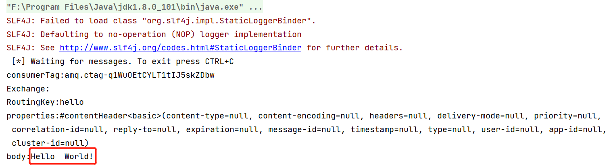

### 3.2. Work Queues

在 Hello World 模式下，一个队列只用于特定的一个生产者和一个消费者。在工作队列（Work queues）模式中，我们将创建一个*工作队列*，该*队列*将用于在多个工作人员之间分配耗时的任务。

在此模式下，生产者发送的多个消息，可以有多个消费者依次接收（但一个消息只有一个人能接收）。

**应用场景**：对于 任务过重或任务较多情况使用工作队列可以提高任务处理的速度。

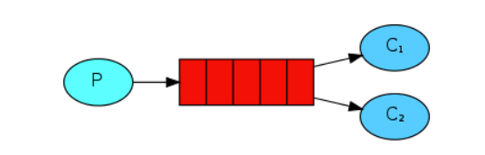

下面将将用Java编写三个程序。一个是生产者，用于发送消息；两个是消费者，用于接收消息。

**3.2.1. 编写生产者代码**

创建一个类com.tju.producer.Producer_WorkQueues

~~~java
public class Producer_WorkQueues {
    public static void main(String[] args) throws IOException, TimeoutException {
        // 1. 创建工厂
        ConnectionFactory factory = new ConnectionFactory();
        // 2. 设置参数
        factory.setHost("127.0.0.1");  // ip,默认值"localhost"
        factory.setPort(5672); // 端口，默认值5672
        factory.setVirtualHost("tju_virtual"); // 虚拟机，默认值"/"
        factory.setUsername("zhang");  // 用户名，默认值guest
        factory.setPassword("123");  // 密码，默认值guest
        // 3. 创建连接 Connection
        Connection connection = factory.newConnection();
        // 4. 创建 Channel
        Channel channel = connection.createChannel();
        // 5. 创建队列 Queue
        /*
            参数1：队列名称(如果没有，则会自动创建)
            参数二：是否持久化
            参数三：是否独占，只能有一个消费者监听队列
            参数四：是否自动删除（当没有消费者时）
            参数五：一些其他参数设置
         */
        channel.queueDeclare("work_queues", false, false, false, null);
        // 6. 发送消息
        for (int i = 1; i <= 10; i++) {
            String message = "【" + i + "】 Hello  World!";
             /*
                参数1：交换机名称，简单模式下交换机会使用默认的""，设置为空字符串即可
                参数2：路由名称
                参数3：配置信息
                参数4：真实发送的消息数据（字节数组的形式byte[]）
             */
            channel.basicPublish("", "work_queues", null, message.getBytes(StandardCharsets.UTF_8));
            System.out.println(" [x] Sent '" + message + "'");
        }

        // 7. 释放资源
        channel.close();
        connection.close();
    }
}
~~~

**3.2.2. 编写消费者代码**

创建第一个类com.tjuconsumer.Consumer_WorkQueues1

~~~java
public class Consumer_WorkQueues1 {
    public static void main(String[] args) throws IOException, TimeoutException {
        // 1. 创建工厂
        ConnectionFactory factory = new ConnectionFactory();
        // 2. 设置参数
        factory.setHost("127.0.0.1");  // ip,默认值"localhost"
        factory.setPort(5672); // 端口，默认值5672
        factory.setVirtualHost("tju_virtual"); // 虚拟机，默认值"/"
        factory.setUsername("zhang");  // 用户名，默认值guest
        factory.setPassword("123");  // 密码，默认值guest
        // 3. 创建连接 Connection
        Connection connection = factory.newConnection();
        // 4. 创建 Channel
        Channel channel = connection.createChannel();
        // 5. 创建队列 Queue (参数1：队列名称(如果没有，则会自动创建) 参数二：是否持久化 参数三：是否独占，只能有一个消费者监听队列 参数四：是否自动删除（当没有消费者时）参数五：一些其他参数设置)
        channel.queueDeclare("work_queues", false, false, false, null);
        System.out.println(" [*] Waiting for messages. To exit press CTRL+C");

        // 6. 接收消息
        Consumer consumer = new DefaultConsumer(channel) {
            /**
             * 回调方法，当收到消息后，会自动执行该方法
             * @param consumerTag 标识
             * @param envelope 获取一些信息（比如交换机，路由key...）
             * @param properties 配置信息
             * @param body 真实数据
             * @throws IOException
             */
            @Override
            public void handleDelivery(String consumerTag, Envelope envelope, AMQP.BasicProperties properties, byte[] body) throws IOException {
                System.out.println("body:" + new String(body));
            }
        };

        //  参数1：队列名称 参数2：是否自动确认 参数3：回调函数
        channel.basicConsume("work_queues", true, consumer);

        // 注意消费者不要关闭资源，一直监听
    }
}
~~~

创建第二个类com.tjuconsumer.Consumer_WorkQueues2

~~~java
public class Consumer_WorkQueues2 {
    public static void main(String[] args) throws IOException, TimeoutException {
        // 1. 创建工厂
        ConnectionFactory factory = new ConnectionFactory();
        // 2. 设置参数
        factory.setHost("127.0.0.1");  // ip,默认值"localhost"
        factory.setPort(5672); // 端口，默认值5672
        factory.setVirtualHost("tju_virtual"); // 虚拟机，默认值"/"
        factory.setUsername("zhang");  // 用户名，默认值guest
        factory.setPassword("123");  // 密码，默认值guest
        // 3. 创建连接 Connection
        Connection connection = factory.newConnection();
        // 4. 创建 Channel
        Channel channel = connection.createChannel();
        // 5. 创建队列 Queue (参数1：队列名称(如果没有，则会自动创建) 参数二：是否持久化 参数三：是否独占，只能有一个消费者监听队列 参数四：是否自动删除（当没有消费者时）参数五：一些其他参数设置)
        channel.queueDeclare("work_queues", false, false, false, null);
        System.out.println(" [*] Waiting for messages. To exit press CTRL+C");

        // 6. 接收消息
        Consumer consumer = new DefaultConsumer(channel) {
            /**
             * 回调方法，当收到消息后，会自动执行该方法
             * @param consumerTag 标识
             * @param envelope 获取一些信息（比如交换机，路由key...）
             * @param properties 配置信息
             * @param body 真实数据
             * @throws IOException
             */
            @Override
            public void handleDelivery(String consumerTag, Envelope envelope, AMQP.BasicProperties properties, byte[] body) throws IOException {
                System.out.println("body:" + new String(body));
            }
        };

        //  参数1：队列名称 参数2：是否自动确认 参数3：回调函数
        channel.basicConsume("work_queues", true, consumer);
        // 注意消费者不要关闭资源，一直监听
    }
}
~~~

**3.2.3. 执行**

首先执行两个消费者代码，接着执行生产者代码，然后就会发现，生产者发送的消息，被两个消费者所依次接收了。

- 第一个消费者输出的内容

  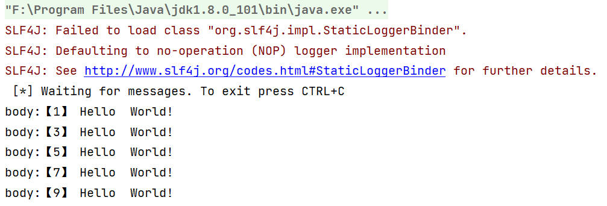

- 第二个消费者输出的内容

  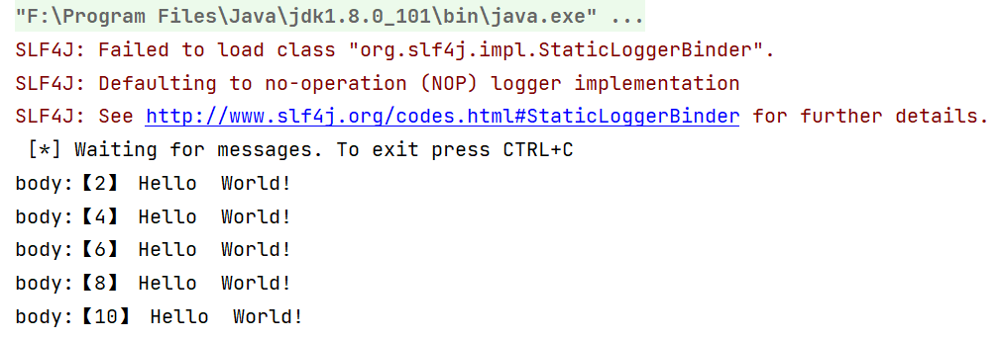

### 3.3. Publish/Subscribe

在 Work queues 模式下，每个消息都恰好交付给一个消费者。在发布/订阅（Publish/Subscribe）模式中，我们将同一个消息可以传达给多个消费者。

在此模式下，生产者发送的单个消息，可以有多个消费者进行接收。

相比于之前的模式，发布/订阅模式多了一个交换机（Exchange），由下图中的X表示。生产者不再直接把消息发送给队列，而是发送给交换机。交换机可以通过与某个队列绑定，会把从生产者获得的消息传递给相应满足规则（路由key）的队列。

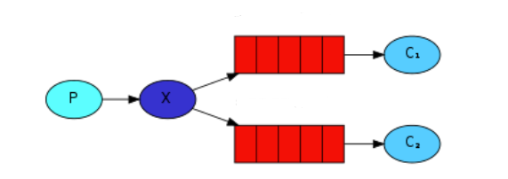

- 生产者：也就是要发送消息的程序，但是不再发送到队列中，而是发给X（交换机）
- 消费者：消息的接受者，会一直等待消息到来。
- 消息队列用于接收消息、缓存消息、发送消息。
- 交换机：图中的X。一方面，接收生产者发送的消息。另一方面，知道如何处理消息，例如递交给某个特别队列、递交给所有队列、或是将消息丢弃。到底如何操作，取决于Exchange的类型。Exchange有常见以下3种类型：
  - `Fanout`：广播，将消息交给所有绑定到交换机的队列
  - `Direct`：定向，把消息交给符合指定routing key 的队列
  - `Topic`：通配符，把消息交给符合routing pattern（路由模式） 的队列

具体流程为：

- 每个消费者监听自己的队列。

- 生产者将消息发给 broker（其实就是发给交换机），由交换机将消息转发到绑定此交换机的每个队列，每个绑定交换机的队列都将接收到消息

**发布订阅模式与工作队列模式的区别**

1、工作队列模式不用定义交换机，而发布/订阅模式需要定义交换机。 

2、发布/订阅模式的生产方是面向交换机发送消息，工作队列模式的生产方是面向队列发送消息(底层使用默认交换机)。

3、发布/订阅模式需要设置队列和交换机的绑定，工作队列模式不需要设置，实际上工作队列模式会将队列绑 定到默认的交换机 。

下面将将用Java编写三个程序。一个是生产者，用于发送消息；两个是消费者，用于接收消息。

**3.3.1. 编写生产者代码**

创建一个类com.tju.producer.Producer_PubSub

~~~java
public class Producer_PubSub {
    public static void main(String[] args) throws IOException, TimeoutException {
        // 1. 创建工厂
        ConnectionFactory factory = new ConnectionFactory();
        // 2. 设置参数
        factory.setHost("127.0.0.1");  // ip,默认值"localhost"
        factory.setPort(5672); // 端口，默认值5672
        factory.setVirtualHost("tju_virtual"); // 虚拟机，默认值"/"
        factory.setUsername("zhang");  // 用户名，默认值guest
        factory.setPassword("123");  // 密码，默认值guest
        // 3. 创建连接 Connection
        Connection connection = factory.newConnection();
        // 4. 创建 Channel
        Channel channel = connection.createChannel();
        // 5. 创建交换机
        /*
            参数1：交换机名称
            参数2：交换机的类型（direct定向、fanout广播、topic通配符、headers参数匹配）
            参数3：是否持久化
            参数4：自动删除
            参数5：内部使用，一般false
            参数6：其他参数
         */
        channel.exchangeDeclare("test_fanout", BuiltinExchangeType.FANOUT,true,false,false,null);
        // 6. 创建队列
        channel.queueDeclare("test_fanout_queue1",true,false,false,null);
        channel.queueDeclare("test_fanout_queue2",true,false,false,null);
        // 7. 绑定队列和交换机(参数：队列名称、交换机名称、路由key，即绑定规则（如果交换机类型为fanout，则只需设置为""）)
        channel.queueBind("test_fanout_queue1","test_fanout","");
        channel.queueBind("test_fanout_queue2","test_fanout","");
        // 8. 发送消息
        for (int i = 0; i < 10 ; i++) {
            String message = "这是日志信息【" + i + "】";
            channel.basicPublish("test_fanout","",null,message.getBytes(StandardCharsets.UTF_8));
        }
        // 9. 释放资源
        channel.close();
        connection.close();
    }
}
~~~

**3.3.2. 编写消费者代码**

创建第一个类 com.tjuconsumer.Consumer_PubSub1

~~~java
public class Consumer_PubSub1 {
    public static void main(String[] args) throws IOException, TimeoutException {
        // 1. 创建工厂
        ConnectionFactory factory = new ConnectionFactory();
        // 2. 设置参数
        factory.setHost("127.0.0.1");  // ip,默认值"localhost"
        factory.setPort(5672); // 端口，默认值5672
        factory.setVirtualHost("tju_virtual"); // 虚拟机，默认值"/"
        factory.setUsername("zhang");  // 用户名，默认值guest
        factory.setPassword("123");  // 密码，默认值guest
        // 3. 创建连接 Connection
        Connection connection = factory.newConnection();
        // 4. 创建 Channel
        Channel channel = connection.createChannel();
//        // 5. 创建队列 Queue (参数1：队列名称(如果没有，则会自动创建) 参数二：是否持久化 参数三：是否独占，只能有一个消费者监听队列 参数四：是否自动删除（当没有消费者时）参数五：一些其他参数设置)
//        channel.queueDeclare("test_fanout_queue1", false, false, false, null);
        // 当创建过队列后，其实就没必要再重新创建了，直接根据队列名接收消息就可以了
        System.out.println(" [*] Waiting for messages. To exit press CTRL+C");

        // 6. 接收消息
        Consumer consumer = new DefaultConsumer(channel) {
            @Override
            public void handleDelivery(String consumerTag, Envelope envelope, AMQP.BasicProperties properties, byte[] body) throws IOException {
                System.out.println("消费者1接收:" + new String(body));
            }
        };
        //  参数1：队列名称 参数2：是否自动确认 参数3：回调函数
        channel.basicConsume("test_fanout_queue1", true, consumer);
    }
}
~~~

创建第二个类 com.tjuconsumer.Consumer_PubSub2

~~~java
public class Consumer_PubSub2 {
    public static void main(String[] args) throws IOException, TimeoutException {
        // 1. 创建工厂
        ConnectionFactory factory = new ConnectionFactory();

        // 2. 设置参数
        factory.setHost("127.0.0.1");  // ip,默认值"localhost"
        factory.setPort(5672); // 端口，默认值5672
        factory.setVirtualHost("tju_virtual"); // 虚拟机，默认值"/"
        factory.setUsername("zhang");  // 用户名，默认值guest
        factory.setPassword("123");  // 密码，默认值guest

        // 3. 创建连接 Connection
        Connection connection = factory.newConnection();

        // 4. 创建 Channel
        Channel channel = connection.createChannel();

        System.out.println(" [*] Waiting for messages. To exit press CTRL+C");
        
        // 5. 接收消息
        Consumer consumer = new DefaultConsumer(channel) {
            @Override
            public void handleDelivery(String consumerTag, Envelope envelope, AMQP.BasicProperties properties, byte[] body) throws IOException {
                System.out.println("消费者2接收:" + new String(body));
            }
        };

        //  参数1：队列名称 参数2：是否自动确认 参数3：回调函数
        channel.basicConsume("test_fanout_queue2", true, consumer);
    }
}
~~~

**3.3.3. 执行**

首先执行两个消费者代码，接着执行生产者代码，然后就会发现，生产者发送的消息，被两个消费者均接收了。

- 第一个消费者输出的内容

  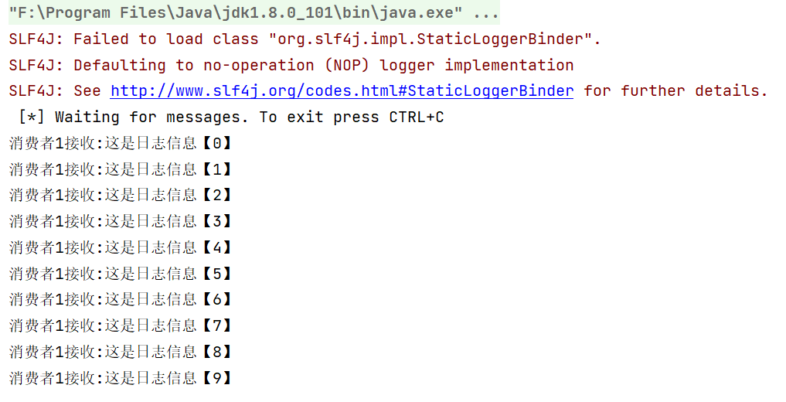

- 第二个消费者输出的内容

  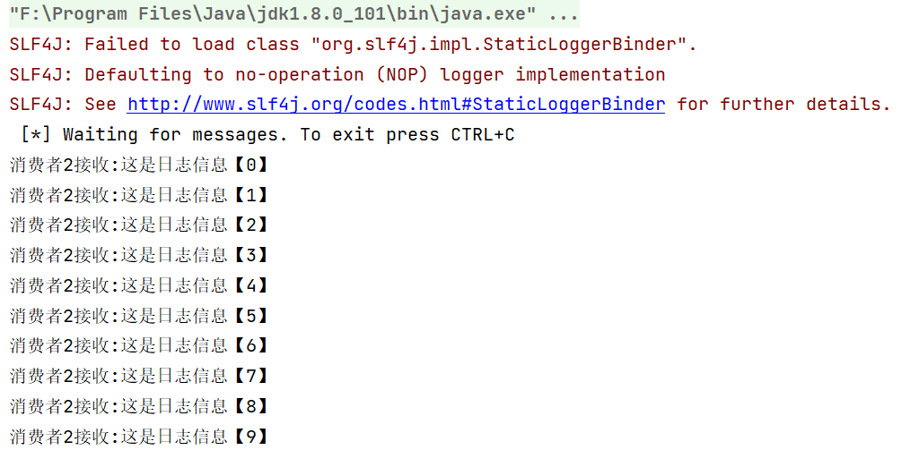

### 3.4. Routing

路由模式特点：

- 队列与交换机的绑定，不能是任意绑定了，而是要指定一个`RoutingKey`（路由key）
- 消息的发送方在向 Exchange发送消息时，也必须指定消息的 `RoutingKey`。
- Exchange不再把消息交给每一个绑定的队列，而是根据消息的`Routing Key`进行判断，只有队列的`Routingkey`与消息的 `Routing key`完全一致，才会接收到消息。

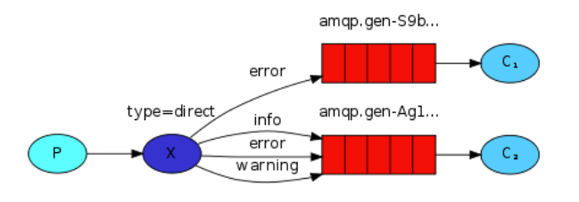

- P：生产者，向Exchange发送消息，发送消息时，会指定一个routing key。
- X：Exchange（交换机），接收生产者的消息，然后把消息递交给 与routing key完全匹配的队列
- C1：消费者，其所在队列指定了需要routing key 为 error 的消息
- C2：消费者，其所在队列指定了需要routing key 为 info、error、warning 的消息

具体流程为：

- 每个消费者监听自己的队列。

- 生产者将消息发给 broker（其实就是发给交换机），由交换机将消息转发到绑定此交换机的每个队列，每个绑定交换机的队列都将接收到消息

下面将将用Java编写三个程序。一个是生产者，用于发送消息；两个是消费者，用于接收消息。

在编码上与 `Publish/Subscribe发布与订阅模式` 的区别是交换机的类型为：Direct，还有队列绑定交换机的时候需要指定routing key。

**3.4.1. 编写生产者代码**

创建一个类com.tju.producer.Producer_Routing

~~~java
public class Producer_Routing {
    public static void main(String[] args) throws IOException, TimeoutException {
        // 1. 创建工厂
        ConnectionFactory factory = new ConnectionFactory();
        // 2. 设置参数
        factory.setHost("127.0.0.1");  // ip,默认值"localhost"
        factory.setPort(5672); // 端口，默认值5672
        factory.setVirtualHost("tju_virtual"); // 虚拟机，默认值"/"
        factory.setUsername("zhang");  // 用户名，默认值guest
        factory.setPassword("123");  // 密码，默认值guest
        // 3. 创建连接 Connection
        Connection connection = factory.newConnection();
        // 4. 创建 Channel
        Channel channel = connection.createChannel();
        // 5. 创建交换机
        /*
            参数1：交换机名称
            参数2：交换机的类型（direct定向、fanout广播、topic通配符、headers参数匹配）
            参数3：是否持久化
            参数4：自动删除
            参数5：内部使用，一般false
            参数6：其他参数
         */
        channel.exchangeDeclare("test_direct", BuiltinExchangeType.DIRECT,true,false,false,null);
        // 6. 创建队列
        channel.queueDeclare("test_direct_queue1",true,false,false,null);
        channel.queueDeclare("test_direct_queue2",true,false,false,null);
        // 7. 绑定队列和交换机(参数：队列名称、交换机名称、路由key，即绑定规则（如果交换机类型为fanout，则只需设置为""）)
        // 队列1与交换机绑定，,规则为error
        channel.queueBind("test_direct_queue1","test_direct","error");
        // 队列2与交换机绑定，,规则为error、info、warning
        channel.queueBind("test_direct_queue2","test_direct","info");
        channel.queueBind("test_direct_queue2","test_direct","error");
        channel.queueBind("test_direct_queue2","test_direct","warning");
        // 8. 发送消息
        String message = "这是一条日志信息";
        /*
            参数1：交换机名称
            参数2：Routing key，即绑定的规则
            参数3：配置信息
            参数4：要发送的消息
         */
        channel.basicPublish("test_direct","info",null,message.getBytes(StandardCharsets.UTF_8));
        // 9. 释放资源
        channel.close();
        connection.close();
    }
}
~~~

**3.4.2. 编写消费者代码**

创建第一个类com.tjuconsumer.Consumer_Routing1

~~~java
public class Consumer_Routing1 {
    public static void main(String[] args) throws IOException, TimeoutException {
        // 1. 创建工厂
        ConnectionFactory factory = new ConnectionFactory();
        // 2. 设置参数
        factory.setHost("127.0.0.1");  // ip,默认值"localhost"
        factory.setPort(5672); // 端口，默认值5672
        factory.setVirtualHost("tju_virtual"); // 虚拟机，默认值"/"
        factory.setUsername("zhang");  // 用户名，默认值guest
        factory.setPassword("123");  // 密码，默认值guest
        // 3. 创建连接 Connection
        Connection connection = factory.newConnection();
        // 4. 创建 Channel
        Channel channel = connection.createChannel();
        // 5. 接收消息
        Consumer consumer = new DefaultConsumer(channel) {
            @Override
            public void handleDelivery(String consumerTag, Envelope envelope, AMQP.BasicProperties properties, byte[] body) throws IOException {
                System.out.println("body:" + new String(body));
                System.out.println("将日志信息打印到控制台...");
            }
        };
        //  参数1：队列名称 参数2：是否自动确认 参数3：回调函数
        channel.basicConsume("test_direct_queue1", true, consumer);
    }
}
~~~

创建第二个类com.tjuconsumer.Consumer_Routing2

~~~java
public class Consumer_Routing2 {
    public static void main(String[] args) throws IOException, TimeoutException {
        // 1. 创建工厂
        ConnectionFactory factory = new ConnectionFactory();
        // 2. 设置参数
        factory.setHost("127.0.0.1");  // ip,默认值"localhost"
        factory.setPort(5672); // 端口，默认值5672
        factory.setVirtualHost("tju_virtual"); // 虚拟机，默认值"/"
        factory.setUsername("zhang");  // 用户名，默认值guest
        factory.setPassword("123");  // 密码，默认值guest
        // 3. 创建连接 Connection
        Connection connection = factory.newConnection();
        // 4. 创建 Channel
        Channel channel = connection.createChannel();
        // 5. 接收消息
        Consumer consumer = new DefaultConsumer(channel) {
            @Override
            public void handleDelivery(String consumerTag, Envelope envelope, AMQP.BasicProperties properties, byte[] body) throws IOException {
                System.out.println("body:" + new String(body));
                System.out.println("将日志信息保存到磁盘...");
            }
        };
        //  参数1：队列名称 参数2：是否自动确认 参数3：回调函数
        channel.basicConsume("test_direct_queue2", true, consumer);
    }
}
~~~

**3.4.3. 执行**

首先执行两个消费者代码，接着执行生产者代码，然后就会发现，由于我们发送消息时，绑定的规则为info，只与队列2的规则匹配，而与队列1的规则不匹配，从而消息只会发送到队列2，不会发送到队列1，因此消费者1不能收到消息，消费者2可以收到消息。

- 第一个消费者输出的内容

  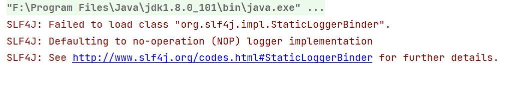

- 第二个消费者输出的内容

  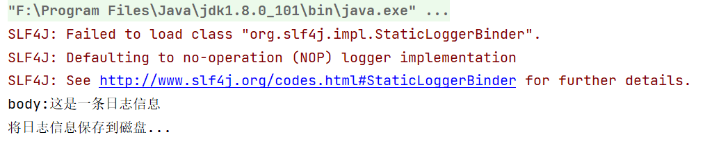

### 3.5. Topics

`Topic`类型与`Direct`相比，都是可以根据`RoutingKey`把消息路由到不同的队列。只不过`Topic`类型`Exchange`可以让队列在绑定`Routing key` 的时候**使用通配符**！

`Routingkey` 一般都是有一个或多个单词组成，多个单词之间以”.”分割，例如： `item.insert`

 通配符规则：

- 路由格式必须以 `.` 分隔，比如 `user.email` 或者 `user.aaa.email`

- `#`：匹配一个或多个词

- `*`：匹配不多不少恰好1个词

举例：

`item.#`：能够匹配`item.insert.abc` 或者 `item.insert`

`item.*`：只能匹配`item.insert`

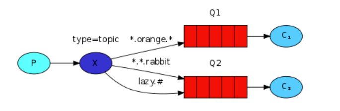

具体流程为：

- 每个消费者监听自己的队列。

- 生产者将消息发给broker（其实就是发给交换机），由交换机将消息转发到绑定此交换机的每个队列，每个绑定交换机的队列都将接收到消息

下面将将用Java编写三个程序。一个是生产者，用于发送消息；两个是消费者，用于接收消息。

**3.4.1. 编写生产者代码**

创建一个类com.tju.producer.Producer_Topics

~~~java
public class Producer_Topics {
    public static void main(String[] args) throws IOException, TimeoutException {
        // 1. 创建工厂
        ConnectionFactory factory = new ConnectionFactory();
        // 2. 设置参数
        factory.setHost("127.0.0.1");  // ip,默认值"localhost"
        factory.setPort(5672); // 端口，默认值5672
        factory.setVirtualHost("tju_virtual"); // 虚拟机，默认值"/"
        factory.setUsername("zhang");  // 用户名，默认值guest
        factory.setPassword("123");  // 密码，默认值guest
        // 3. 创建连接 Connection
        Connection connection = factory.newConnection();
        // 4. 创建 Channel
        Channel channel = connection.createChannel();
        // 5. 创建交换机
        /*
            参数1：交换机名称
            参数2：交换机的类型（direct定向、fanout广播、topic通配符、headers参数匹配）
            参数3：是否持久化
            参数4：自动删除
            参数5：内部使用，一般false
            参数6：其他参数
         */
        channel.exchangeDeclare("test_topic", BuiltinExchangeType.TOPIC,true,false,false,null);
        // 6. 创建队列
        channel.queueDeclare("test_topic_queue1",true,false,false,null);
        channel.queueDeclare("test_topic_queue2",true,false,false,null);
        // 7. 绑定队列和交换机(参数：队列名称、交换机名称、路由key，即绑定规则（如果交换机类型为fanout，则只需设置为""）)
        // 队列1与交换机绑定，规则为以order开头或者error结尾
        channel.queueBind("test_topic_queue1","test_topic","#.error");
        channel.queueBind("test_topic_queue1","test_topic","order.#");
        // 队列2与交换机绑定，规则为任意
        channel.queueBind("test_topic_queue2","test_topic","#.#");
        // 8. 发送消息
        String message = "这是一条日志信息";
        /*
            参数1：交换机名称
            参数2：Routing key，即绑定的规则
            参数3：配置信息
            参数4：要发送的消息
         */
        channel.basicPublish("test_topic","x",null,message.getBytes(StandardCharsets.UTF_8));
        // 9. 释放资源
        channel.close();
        connection.close();
    }
}
~~~

**3.4.2. 编写消费者代码**

创建第一个类com.tjuconsumer.Consumer_Topics1

~~~java
public class Consumer_Topics1 {
    public static void main(String[] args) throws IOException, TimeoutException {
        // 1. 创建工厂
        ConnectionFactory factory = new ConnectionFactory();
        // 2. 设置参数
        factory.setHost("127.0.0.1");  // ip,默认值"localhost"
        factory.setPort(5672); // 端口，默认值5672
        factory.setVirtualHost("tju_virtual"); // 虚拟机，默认值"/"
        factory.setUsername("zhang");  // 用户名，默认值guest
        factory.setPassword("123");  // 密码，默认值guest
        // 3. 创建连接 Connection
        Connection connection = factory.newConnection();
        // 4. 创建 Channel
        Channel channel = connection.createChannel();
        // 5. 接收消息
        Consumer consumer = new DefaultConsumer(channel) {
            @Override
            public void handleDelivery(String consumerTag, Envelope envelope, AMQP.BasicProperties properties, byte[] body) throws IOException {
                System.out.println("body:" + new String(body));
                System.out.println("将日志信息打印到控制台...");
            }
        };
        //  参数1：队列名称 参数2：是否自动确认 参数3：回调函数
        channel.basicConsume("test_topic_queue1", true, consumer);
    }
}
~~~

创建第二个类com.tjuconsumer.Consumer_Topics2

~~~java
public class Consumer_Topics2 {
    public static void main(String[] args) throws IOException, TimeoutException {
        // 1. 创建工厂
        ConnectionFactory factory = new ConnectionFactory();
        // 2. 设置参数
        factory.setHost("127.0.0.1");  // ip,默认值"localhost"
        factory.setPort(5672); // 端口，默认值5672
        factory.setVirtualHost("tju_virtual"); // 虚拟机，默认值"/"
        factory.setUsername("zhang");  // 用户名，默认值guest
        factory.setPassword("123");  // 密码，默认值guest
        // 3. 创建连接 Connection
        Connection connection = factory.newConnection();
        // 4. 创建 Channel
        Channel channel = connection.createChannel();
        // 5. 接收消息
        Consumer consumer = new DefaultConsumer(channel) {
            @Override
            public void handleDelivery(String consumerTag, Envelope envelope, AMQP.BasicProperties properties, byte[] body) throws IOException {
                System.out.println("body:" + new String(body));
                System.out.println("将日志信息保存到磁盘...");
            }
        };
        //  参数1：队列名称 参数2：是否自动确认 参数3：回调函数
        channel.basicConsume("test_topic_queue2", true, consumer);
    }
}
~~~

**3.4.3. 执行**

首先执行两个消费者代码，接着执行生产者代码，然后就会发现，由于我们发送消息时，绑定的规则为x，只与队列2的规则匹配，而与队列1的规则不匹配，从而消息只会发送到队列2，不会发送到队列1，因此消费者1不能收到消息，消费者2可以收到消息。

- 第一个消费者输出的内容

  

- 第二个消费者输出的内容

  

## 4. SpringBoot 整合 RabbitMQ

前面已经介绍了 Java 代码如何操作 RabbitMQ了，但是可以发现，代码非常繁琐，可以利用 SpringBoot 直接整合 RabbitMQ 简化操作，提升开发效率。

### 4.1 Hello World

> 一个生产者，一个消费者。

Hello World 是 RabbitMQ 最简单的一种模式，“ P”表示生产者，“ C”是表示消费者。中间的框是一个队列 Queue，即保留的消息缓冲区。


- *生产*仅意味着发送。发送消息的程序是*生产者*：
- *消费*与接收具有相似的含义。一个*消费者*是一个程序，主要是等待接收信息：
- *队列*是 RabbitMQ 内部的邮政信箱的名称。尽管消息流经 RabbitMQ，但它只能存储在*队列中*。*队列*仅由主机的存储器＆磁盘限制约束，它本质上是一个大的消息缓冲器。许多*生产者*可以发送进入一个队列的消息，许多*消费者*可以尝试从一个*队列*接收数据。

**生产者发送消息**

引入依赖

~~~xml
<dependency>
    <groupId>org.springframework.boot</groupId>
    <artifactId>spring-boot-starter-amqp</artifactId>
</dependency>
~~~

在 application.properties 中配置 rabbitmq

~~~properties
# 配置rabbitmq连接信息
spring.rabbitmq.host=127.0.0.1
spring.rabbitmq.port=5672
spring.rabbitmq.virtual-host=tju_virtual
spring.rabbitmq.username=zhang
spring.rabbitmq.password=123
~~~

创建消息队列（也可以在rabbitmq web界面直接创建）

~~~java
@Configuration
public class RabbitmqConfig {
    //队列名称
    public static final String HELLO_WORLD = "hello.world";
    //声明队列
    @Bean()
    public Queue helloWorldQueue(){
        return QueueBuilder.durable(HELLO_WORLD).build();// 创建一个名称为 hello.world的队列
    }
}
~~~

使用 springboot 提供的 RabbitmqTemplate 进行消息的发送与接收

~~~java
@SpringBootTest
public class SpringAmqpTest {
    @Autowired
    private RabbitTemplate rabbitTemplate;

    // Hello World 模式
    @Test
    public void testHelloWorld(){
        String queue = "hello.world"; // 注意队列应该提前创建好（配置类或直接在web界面创建）
        String message = "Hello RabbitTemplate！"; // 消息可以为任意类型，会自动转换
        rabbitTemplate.convertAndSend(queue,message);  // 发送消息
    }
}
~~~

**消费者接收消息**

引入依赖、在 application.properties 中配置 rabbitmq。

监听消息，新建一个类注入到 IOC 中，并使用 @RabbitListener 注解指定监听的队列。

~~~java
@Component
public class RabbitmqListener {
    /**
     * 【 Hello World 模式】监听某个队列的消息
     * @param message 接收到的消息
     */
    @RabbitListener(queues = "hello.world")
    public void helloWorldListener(String message){
        System.out.println("消费者接收到的消息为：" + message);
    }
}
~~~

启动 SpringBoot 服务即可。

注意：消息一旦消费就会从队列删除，RabbitMQ 没有消息回溯功能

### 4.2 Work Queues

> 一个生产者，多个消费者，且一条消息只能被一个消费者所消费。

在 Hello World 模式下，一个队列只用于特定的一个生产者和一个消费者。在工作队列（Work queues）模式中，我们将创建一个*工作队列*，该*队列*将用于在多个工作人员之间分配耗时的任务。

在此模式下，生产者发送的多个消息，可以有多个消费者依次接收（但一个消息只有一个人能接收）。

**应用场景**：对于 任务过重或任务较多情况，可能生产消息的速度会 远远大于消息的消费速度。长此以往，消息就会堆积越来越多，无法及时处理，此时使用工作队列可以提高任务处理的速度。


**生产者发送消息**

在配置类中创建队列  

~~~java
public static final String WORK_QUEUES ="work.queues";
@Bean()
    public Queue workQueuesQueue(){
        return QueueBuilder.durable(WORK_QUEUES).build();
}
~~~

使用 RabbitTemplate 发送消息【和 Hello World 模式一致】

~~~java
// Work Queues 模式
@Test
public void testWorkQueues(){
    String queue = "work.queues";
    String message = "Hello RabbitTemplate，Message_";
    for(int i=1;i<=50;i++){
        rabbitTemplate.convertAndSend(queue,message + i);
    }
}
~~~

**消费者接收消息**

~~~java
/**
 * 【 Work Queues 模式】监听某个队列的消息
 * @param message 接收到的消息
 */
@RabbitListener(queues = "work.queues")
public void workQueuesListener1(String message) throws InterruptedException {
    System.err.println("消费者1接收到的消息为：" + message);
    Thread.sleep(20);  // 模拟不同消费者，有不同的消息处理能力
}

/**
 * 【 Work Queues 模式】监听某个队列的消息
 * @param message 接收到的消息
 */
@RabbitListener(queues = "work.queues")
public void WorkQueuesListener2(String message) throws InterruptedException {
    System.out.println("消费者2接收到的消息为：" + message);
    Thread.sleep(200);
}
~~~

此时会发现，消费者 1 和消费者 2 的消息处理能力虽然不同，却消费同样多的消息，也就是说消息被『平均消费』了。

然而由于不同的消费者有不同的处理速度，处理速度快的应该处理更多的消息，我们可以通过添加以下配置达到这种『能者多劳』的效果，此时消费者 1 和消费者 2 处理的消息数量将不同。 

~~~properties
# 每次只能获取一条消息，处理完成才能获取下一个消息（也可以实现限流的效果）
spring.rabbitmq.listener.simple.prefetch=1
~~~

### 4.3 Publish/Subscribe

>生产者发送的单个消息，所有消费者都进行接收。

在 Work queues 模式下，每个消息都恰好交付给一个消费者。在发布/订阅（Publish/Subscribe）模式中，我们将同一个消息可以传达给多个消费者。

相比于之前的模式，发布/订阅模式多了一个交换机（Exchange），由下图中的X表示。生产者不再直接把消息发送给队列，而是发送给交换机。交换机可以通过与某个队列绑定，会把从生产者获得的消息传递给相应满足规则（路由key）的队列。


- 生产者：也就是要发送消息的程序，但是不再发送到队列中，而是发给X（交换机）
- 消费者：消息的接受者，会一直等待消息到来。
- 消息队列用于接收消息、缓存消息、发送消息。
- 交换机：图中的X。一方面，接收生产者发送的消息。另一方面，知道如何处理消息，例如递交给某个特别队列、递交给所有队列、或是将消息丢弃。到底如何操作，取决于Exchange的类型。Exchange有常见以下3种类型：
  - `Fanout`：广播，将消息交给所有绑定到交换机的队列
  - `Direct`：定向，把消息交给符合指定 routing key 的队列
  - `Topic`：通配符，把消息交给符合 routing pattern（路由模式） 的队列

具体流程为：

- 每个消费者监听自己的队列。

- 生产者将消息发给 broker（其实就是发给交换机），由交换机将消息转发到绑定此交换机的每个队列，每个绑定交换机的队列都将接收到消息

**消费者发送消息**

在配置类中创建队列和交换机，并进行绑定

~~~java
// 队列名称
public static final String FANOUT_QUEUE1 ="fanout.queue1";
public static final String FANOUT_QUEUE2 ="fanout.queue2";
// 交换机名称
public static final String FANOUT_EXCHANGE ="fanout.exchange";   

// 声明队列
@Bean()
public Queue fanoutQueue1(){
    return QueueBuilder.durable(FANOUT_QUEUE1).build();
}
@Bean()
public Queue fanoutQueue2(){
    return QueueBuilder.durable(FANOUT_QUEUE2).build();
}
// 声明交换机（广播形式）
@Bean
public FanoutExchange fanoutExchange(){
    return ExchangeBuilder.fanoutExchange(FANOUT_EXCHANGE).durable(true).build();
}
// 绑定队列和交换机
@Bean
public Binding bindingQueue1(@Qualifier("fanoutQueue1") Queue queue, @Qualifier("fanoutExchange") FanoutExchange exchange){
    return BindingBuilder.bind(queue).to(exchange);
}
@Bean
public Binding bindingQueue2(@Qualifier("fanoutQueue2") Queue queue, @Qualifier("fanoutExchange") FanoutExchange exchange){
    return BindingBuilder.bind(queue).to(exchange);
}
~~~

使用 RabbitTemplate 发送消息【和 Hello World 模式一致】

~~~java
// Publish/Subscribe 模式,交换机使用 Fanout 广播
@Test
public void testFanoutExchange(){
    String exchange = "fanout.exchange";
    String message = "Hello RabbitTemplate！，Message_";
    for(int i=1;i<=50;i++){
        rabbitTemplate.convertAndSend(exchange,"",message + i); // 会将消息发送到交换机，而不是队列
    }
}
~~~

**消费者接收消息**

~~~java
/**
 * 【 Publish/Subscribe 模式】监听某个队列的消息
 * @param message 接收到的消息
 */
@RabbitListener(queues = "fanout.queue1")
public void fanoutQueueListener1(String message) throws InterruptedException {
    System.err.println("消费者1接收到的消息为：" + message);
}

/**
 * 【 Publish/Subscribe 模式】监听某个队列的消息
 * @param message 接收到的消息
 */
@RabbitListener(queues = "fanout.queue2")
public void fanoutQueueListener2(String message) throws InterruptedException {
    System.out.println("消费者2接收到的消息为：" + message);
}
~~~

此时消费者 1 和消费者 2 均接收到生产者发送的所有消息。

### 4.4 Routing

>生产者发送的单个消息，可以绑定多个消费者进行接收。

路由模式特点：

- 队列与交换机的绑定，不能是任意绑定了，而是要指定一个`RoutingKey`（路由key），因此成为路由模式。
- 消息的发送方在向 Exchange 发送消息时，也必须指定消息的 `RoutingKey`。
- Exchange 不再把消息交给每一个绑定的队列，而是根据消息的`Routing Key`进行判断，只有队列的`Routingkey`与消息的 `Routing key`完全一致，才会接收到消息。


- P：生产者，向Exchange发送消息，发送消息时，会指定一个routing key。
- X：Exchange（交换机），接收生产者的消息，然后把消息递交给 与routing key完全匹配的队列
- C1：消费者，其所在队列指定了需要routing key 为 error 的消息
- C2：消费者，其所在队列指定了需要routing key 为 info、error、warning 的消息

具体流程为：

- 每个消费者监听自己的队列。

- 生产者将消息发给 broker（其实就是发给交换机），由交换机将消息转发到绑定此交换机的每个队列，每个绑定交换机的队列都将接收到消息

我们可以向之前那样，先在配置类中声明队列、交换机、绑定等信息，不过还有一种更简单的写法，直接在消费者的监听类中，在 @RabbitListener 注解中声明各种信息！

**消费者接收消息**

~~~java
/**
 * 【 Routing 模式】监听某个队列的消息,交换机采用 direct定向方式
 * @param message 接收到的消息
 */
@RabbitListener(bindings = @QueueBinding(
        value = @Queue(name = "direct.queue1"), // 队列名称
        exchange = @Exchange(name = "direct.exchange", type = ExchangeTypes.DIRECT), // 交换机名称和类型
        key = {"user"})  // key 可以写多个，用逗号分隔开
)
public void directQueueListener1(String message) throws InterruptedException {
    System.out.println("用户接收到的消息为：" + message);
}

/**
 * 【 Routing 模式】监听某个队列的消息,交换机采用 direct定向方式
 * @param message 接收到的消息
 */
@RabbitListener(bindings = @QueueBinding(
        value = @Queue(name = "direct.queue2"), // 队列名称
        exchange = @Exchange(name = "direct.exchange", type = ExchangeTypes.DIRECT), // 交换机名称和类型
        key = {"admin"})  // key 可以写多个，用逗号分隔开
)
public void directQueueListener2(String message) throws InterruptedException {
    System.out.println("管理员接收到的消息为：" + message);
}
~~~

**生产者发送消息**

~~~java
// Routing 模式,交换机使用 direct 定向
@Test
public void testDirectExchange(){
    String exchange = "direct.exchange";
    String message2User = "这条消息只有用户可以收到！";
    String message2Admin = "这条消息只有管理员可以收到！";
    rabbitTemplate.convertAndSend(exchange,"user",message2User); // 会将消息发送到交换机，而不是队列
    rabbitTemplate.convertAndSend(exchange,"admin",message2Admin); // 会将消息发送到交换机，而不是队列
}
~~~

此时不同消费者只能接收到符合所绑定key的消息。

### 4.5 Topics

>生产者发送的单个消息，可以绑定多个消费者（支持通配符）进行接收。

`Topic `类型与 `Direct `相比，都是可以根据 `RoutingKey` 把消息路由到不同的队列。只不过 `Topic` 类`Exchange`可以让队列在绑定`Routing key` 的时候**使用通配符**！

`Routingkey` 一般都是有一个或多个单词组成，多个单词之间以点分割，例如： `item.insert`

 通配符规则：

- 路由格式必须以 `.` 分隔，比如 `user.email` 或者 `user.aaa.email`

- `#`：匹配一个或多个词

- `*`：匹配不多不少恰好1个词

举例：

`item.#`：能够匹配`item.insert.abc` 或者 `item.insert`

`item.*`：只能匹配`item.insert`


具体流程为：

- 每个消费者监听自己的队列。

- 生产者将消息发给broker（其实就是发给交换机），由交换机将消息转发到绑定此交换机的每个队列，每个绑定交换机的队列都将接收到消息

**消费者接收消息**

~~~java
/**
 * 【 Topics 模式】监听某个队列的消息,交换机采用 Topic 方式
 * @param message 接收到的消息
 */
@RabbitListener(bindings = @QueueBinding(
        value = @Queue(name = "topic.queue1"), // 队列名称
        exchange = @Exchange(name = "topic.exchange", type = ExchangeTypes.TOPIC), // 交换机名称和类型
        key = {"china.*"})  // key 可以写多个，并且支持通配符写法！！用逗号分隔开
)
public void topicQueueListener1(String message) throws InterruptedException {
    System.out.println("收到前缀为china的消息：" + message);
}

/**
 * 【 Topics 模式】监听某个队列的消息,交换机采用 Topic 方式
 * @param message 接收到的消息
 */
@RabbitListener(bindings = @QueueBinding(
        value = @Queue(name = "topic.queue2"), // 队列名称
        exchange = @Exchange(name = "topic.exchange", type = ExchangeTypes.TOPIC), // 交换机名称和类型
        key = {"#.videos"})  // key 可以写多个，并且支持通配符写法！！用逗号分隔开
)
public void topicQueueListener2(String message) throws InterruptedException {
    System.out.println("收到后缀为videos的消息：" + message);
}
~~~

**生产者发送消息**

~~~java
// Topics 模式,交换机使用 topic 定向
@Test
public void testTopicExchange(){
    String exchange = "topic.exchange";
    String message1 = "消息为：china.people";
    String message2 = "消息为：us.videos";
    String message3 = "消息为：china.videos";
    rabbitTemplate.convertAndSend(exchange,"china.people",message1); 
    rabbitTemplate.convertAndSend(exchange,"us.videos",message2); 
    rabbitTemplate.convertAndSend(exchange,"china.videos",message3);
}
~~~

### 4.6. 模式总结

RabbitMQ工作模式：

**1、简单模式 HelloWorld**
一个生产者、一个消费者，不需要设置交换机（使用默认的交换机）

**2、工作队列模式 Work Queue**
一个生产者、多个消费者（竞争关系），不需要设置交换机（使用默认的交换机）

**3、发布订阅模式 Publish/Subscribe**
需要设置类型为fanout的交换机，并且交换机和队列进行绑定，当发送消息到交换机后，交换机会将消息发送到绑定的队列

**4、路由模式 Routing**
需要设置类型为 direct 的交换机，交换机和队列进行绑定，并且指定routing key，当发送消息到交换机后，交换机会根据routing key 将消息发送到对应的队列

**5、通配符模式 Topics**
需要设置类型为topic的交换机，交换机和队列进行绑定，并且指定**通配符**方式的 routing key，当发送消息到交换机后，交换机会根据 routing key 将消息发送到对应的队列

笼统的说，RabbitMQ工作模式分为两类

- 一类是直接使用队列，包含Hello World 和 Work Queues 模式，不同的在于消费者数量而已。

- 另一类使用交换机，可以使得不同消费者消费相同或者不同的消息，包含 Publish/Subscribe、Routing、Topics模式，不同的是交换机将消息发送到队列的方式不同，Pushlish/Subscribe 采用广播形式，所有队列都存有消息；Routing 采用路由形式，会根据 routing key，将消息发送到指定的队列；Topics 和 Routing 基本一致，只不过 routing key支持通配符而已！

## 5. 消息可靠性

可靠性是评估消息队列优劣的一个重要标准之一，在一些核心业务，尤其是一些涉及到 money 方面的一些业务中，可靠性至关重要！消息队列在传递消息的过程中要保证消息的不丢失。在消息的传递过程中，涉及到生产者、RabbitMQ和消费者，那么消息可能在哪些情况下丢失呢？主要有以下三个方面：

- **消息在生产者到 RabbitMQ 的传递之间丢失。**
- **RabbitMQ 宕机，导致消息丢失。**
- **消费者发生异常，导致消息丢失。**

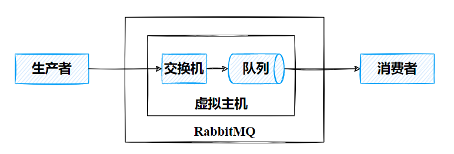

相对应的解决方案如下：

- 生产者丢失消息
  - 开启 RabbitMQ 事务（同步）
  - 开启 confirm 机制（异步，推荐）
- RabbitMQ 丢失消息：开启 RabbitMQ 持久化
- 消费者丢失消息：采用 ack 机制。

### 5.1 生产者丢失消息

> 在生产者将消息投递给消息队列时，可能出现以下问题：
>
> 1. 外界环境问题导致：发生<u>网络丢包、网络故障</u>等造成消息丢失。
> 2. 代码层面，配置层面，考虑不全导致消息丢失，比如<u>发送给不存在的交换器、发送给路由不到的队列。</u>

一般来说，可采用以下两个方案解决消息丢失问题：

**事务机制**

- RabbitMQ 提供了事务功能，生产者发送数据之前开启 RabbitMQ 事务 `channel.txSelect()` ，然后发送消息，如果消息没有成功被 RabbitMQ 接收到，中间出现了某些问题，那么生产者会收到异常报错，此时就可以回滚事务 `channel.txRollback()` ，重新发送消息；如果 RabbitMQ 收到了消息，那么可以提交事务 `channel.txCommit()` 。
- 优点在于事务操作可以保证消息一定能够发送到RabbitMQ中，发送端不会出现消息丢失的情况；
- 缺点在于事务机制是阻塞（同步）的，每次发送消息必须要等到mq回应之后才能继续发送消息，<u>生产者生产消息的吞吐量和性能都会大大降低。</u>

**confirm 机制（推荐）**

- 由于事务操作会大大降低生产者的性能，RabbitMQ 提供了一种` confirm `机制来避免消息发送给 MQ 的过程中出现丢失情况，并且这种机制是『异步的』，<u>在发送完一个消息后可以继续发送下一个消息，MQ 接收到消息后会异步回调接口告知消息接收结果</u>，克服了事务『同步』所固有的缺点。

- 具体而言，生产者开启 `confirm` 机制后，为每个消息指定一个唯一的id，如果消息成功发送到了 MQ 中，那么 MQ 就会返回 一个 **ack** 消息，表示消息接收成功，反之会返回一个 **nack** 消息，表示消息接收失败，可以进行重试。依据这个机制，我们可以维护每个消息 id 的状态，如果超过一定时间还是没有接收到 MQ 的回调，那么就重发消息。

- 在 SpringBoot 配置文件中，配置以下内容

  ~~~yaml
  spring:
    rabbitmq:
      publisher-confirm-type: correlated # 开启消息到达exchange的回调，发送成功失败都会触发回调
      publisher-returns: true	# 开启消息从exhcange路由到queue的回调，只有路由失败时才会触发回调
      template:
        mandatory: true	# 如果exchange根据routingKey将消息路由到queue时找不到匹配的queue，触发return回调，为false时，exchange直接丢弃消息。
  ~~~

  - `publisher-confirm-type  `可以设置为三种类型：simple、correlated,、none;

    - NONE 值是禁用发布确认模式，默认值。
    - CORRELATED 值是**发布消息成功/失败到交换器后会触发回调方法 ConfirmCallback**。
    - SIMPLE 值是同步等待 confirm 结果，直到超时。

    我们可以在 RabbitTemplate 配置 ConfirmCallBack 回调函数，用于接收 MQ 返回的回调信息。可以结合这个机制自己在内存里维护每个消息 id 的状态，如果超过一定时间还没接收到这个消息的回调，那么可以重发消息。

  - `publish-returns`：开启消息**从交换机到队列的回调**，只有路由失败时才会触发回调。我们可以在 RabbitTemplate 配置 ReturnCallback 回调函数。

  - `template.mandatory`：定义消息路由失败时的策略。true，则调用ReturnCallback；false：则直接丢弃消息

  - 总结：

    - 消息正确到达<u>交换机</u>，触发ConfirmCallback 回调，返回 ack，消息没有正确到达交换机，触发ConfirmReturnCallback 回调，返回 nack，并带有异常信息（比如交换机不存在）；
    - 当消息正确发送交换机后，如果消息正确的从交换机路由到<u>队列</u>，不触发 ReturnCallback 回调，而消息没有正确的从交换机路由到队列，在设置 mandory=true 的情况下，触发 ReturnCallback 回调（比如队列不存在）；

  ~~~java
  @Component
  @Slf4j
  public class Producer {
      @Value("${exchange-name}")
      private String exchangeName;
  
      @Resource
      private RabbitTemplate rabbitTemplate;
  
      public void send(){
          // 1. 配置ConfirmCallBack 回调函数
          rabbitTemplate.setConfirmCallback((correlationData, ack, cause)->{
              if(ack){
                  log.info("消息{}接收成功",correlationData.getId());
              }else{
                  log.error("消息{}接收失败，原因{}",correlationData.getId(),cause);
              }
          });
  		// 2.配置ReturnCallback 回调函数
          rabbitTemplate.setReturnCallback((message, replyCode, replyText, exchange, routingKey)->{
              log.error("消息{}发送失败，应答码{}，原因{}，交换机{}，路由键{}",message.toString(),replyCode,replyText,exchange,routingKey);
          });
  		
          // 3.发送消息，注意每个消息要指定一个唯一的id
          for (int i = 0; i < 10; i++) {
              CorrelationData correlationData = new CorrelationData(UUID.randomUUID().toString());
              rabbitTemplate.convertAndSend(exchangeName,"","消息==>"+i,correlationData);
          }
      }
  }
  ~~~

注意：事务机制和确认机制二者不能共存！

### 5.2 RabbitMQ 丢失消息

> RabbitMQ 的消息默认存放在内存上面，如果不特别声明设置，消息不会持久化保存到硬盘上面的。如果消息已经由生产者传递到了 RabbitMQ 的队列中，而消费者还没来得及消费时，RabbitMQ 意外宕机，此时消息就会丢失。

解决方法就是**开启 RabbitMQ 持久化功能**。消息到达队列后，将其持久化到磁盘中，那么即使 RabbitMQ 意外宕机了，也能在重启后自动从磁盘中读取数据，恢复原始消息。

持久化分为以下三个步骤：

1. **交换机设置持久化。**

   SpringAMQP 中可以通过以下代码指定交换机持久化

   ```java
   @Bean
   public DirectExchange simpleExchange(){
       // 三个参数：交换机名称、是否持久化、当没有queue与其绑定时是否自动删除
       return new DirectExchange("simple.direct", true, false);
   }
   ```

   事实上，默认情况下，由 SpringAMQP 声明的交换机都是持久化的，不用特意指定。

2. **队列设置持久化。**

   SpringAMQP 中可以通过代码指定交换机持久化：

   ```java
   @Bean
   public Queue simpleQueue(){
       // 使用QueueBuilder构建队列，durable就是持久化的
       return QueueBuilder.durable("simple.queue").build();
   }
   ```

   事实上，默认情况下，由 SpringAMQP 声明的队列都是持久化的，不用特意指定。

3. **消息设置持久化。**

   利用 SpringAMQP 发送消息时，可以设置消息的属性（MessageProperties），指定 delivery-mode：

   - 1 代表非持久化（NON_PERSISTENT）
   - 2 代表持久化（PERSISTENT）

   ~~~java
   @Test
   public void testDurableMessage() {
       // 1.准备消息
       Message message = MessageBuilder.withBody("hello, spring".getBytes(StandardCharsets.UTF_8))
           .setDeliveryMode(MessageDeliveryMode.PERSISTENT)
           .build();
       // 2.发送消息
       rabbitTemplate.convertAndSend("simple.queue", message);
   }
   ~~~

   事实上，默认情况下，由 SpringAMQP 发出的消息都是持久化的，不用特意指定。

注意：即使 RabbitMQ 开启了持久化机制，也<u>存在丢失数据的一种可能</u>，即消息写到了 RabbitMQ 中，但是还没来得及持久化到磁盘上，此时 RabbitMQ 挂了，就会导致内存里的一点点数据丢失。解决方案是持久化可以跟生产者那边的 `confirm` 机制配合起来，只有消息被持久化到磁盘之后，才会通知生产者 `ack` 了，所以哪怕是在持久化到磁盘之前，RabbitMQ 挂了，数据丢了，生产者收不到 `ack` ，那么生产者也可以重发消息。

### 5.3 消费者丢失消息

> 如果消费者收到消息后没来得及处理或者在处理过程中出现了异常（比如重启或断电等），此时消费者进程挂掉了，而 RabbitMQ 不知道消费者挂掉了，以为消息已经成功被消费了，就会从队列中删除消息，从而导致消息丢失。

解决方法是**采用 RabbitMQ 提供的 ack 确认机制**。当消费者获取消息后，需要向 RabbitMQ 发送 `ack` 回执，表明自己已经处理消息。没有收到 ACK 的消息，消费者断开连接后，RabbitMQ 会把这条消息发送给其他消费者。如果没有其他消费者，消费者重启后会重新消费这条消息，重复执行业务逻辑。其中 `ack` 在 AMQP 中有三种确认模式：

~~~yaml
spring:
  rabbitmq:
    listener:
      simple:
        acknowledge-mode: auto  # none，关闭ack；manual，手动ack；auto：自动ack
~~~

- **manual**：手动 ack，需要在业务代码结束后，调用 api （basicAck/basicNack ）发送 ack/nack

  ~~~java
  @Component
  @Slf4j
  public class MyConsumer {
  
      @RabbitListener(queues = {"${queue-name}"}")
      public void msgConsumer(String msg, Channel channel, Message message) throws IOException {
          try {
              int temp = 10/0;
              log.info("消息{}消费成功",msg);
              channel.basicAck(message.getMessageProperties().getDeliveryTag(), false);
          } catch (Exception e) {
              log.error("接收消息过程中出现异常，执行nack");
              // 第三个参数为true表示异常消息重新返回队列，会导致一直在刷新消息，且返回的消息处于队列头部，影响后续消息的处理
              channel.basicNack(message.getMessageProperties().getDeliveryTag(), false, false);
          }
      }
  }
  ~~~

- **auto**：自动 ack（默认），由 spring 监测 listener 代码是否出现异常，没有异常则返回 ack，反之返回 nack。

  注意：如果消费者执行异常的话，就相当于执行了 nack 方法，消息会requeue（重新入队）到队列头部，然后再次发送给消费者，但是可能消费者继续出现异常，周而复始，消息会被无限期的执行，从而导致后续的消息无法消费。发生这种原因所在便是因为 RabbitMQ的`消息失败重试机制`。但是在很多情况下，我们并不想无限重试，而是重试到一定阈值后，就认为此消息无法被正确处理，就放弃处理或专用人工处理等。

  为了解决这一问题，我们可以在配置文件中对 RabbitMQ 的消息重试（retry）进行重新配置。

  ~~~yaml
  spring:
    rabbitmq:
      listener:
        simple:
          prefetch: 1
          acknowledge-mode: auto  	# 消费者自动ack消息确认
          retry:
            enabled: true            	# 开启消费者失败重试
            initial-interval: 1000  	# 初始失败重试间隔
            multiplier: 3				# 失败的等待时长配置，下次重试间隔= multiplier * initial-interval
            max-attempts: 4   		# 最大重试次数
            stateless: true # true无状态；false有状态。如果业务中包含事务，这里改为false
  ~~~

  在开启重试模式后，重试次数耗尽，如果消息依然失败，则需要有MessageRecoverer接口来处理，它包含三种不同的实现：

  - RejectAndDontRequeueRecoverer：（默认）重试耗尽后，直接 reject，丢弃消息。
  - ImmediateRequeueMessageRecoverer：重试耗尽后，返回 nack，消息重新入队
  - RepublishMessageRecoverer：（推荐）重试耗尽后，将失败消息投递到指定的交换机

  可以看出前两种实现都不太好，推荐第三种方式，当重试几次后，仍然得不到好的处理，就将无法被正确处理的消息投递到指定的交换机中，然后在存储到专门用于存储异常消息的队列中，后续可采取人工方式进行集中处理！

  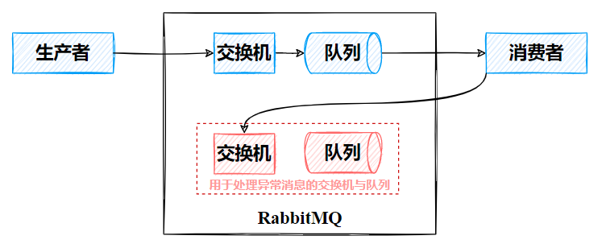

  ~~~java
  @Configuration
  public class ErrorMessageConfig {
  
      // 处理异常消息的交换机
      @Bean
      public DirectExchange errorMessageExchange(){
          return new DirectExchange("error.direct");
      }
  
      // 处理异常消息的队列
      @Bean
      public Queue errorQueue(){
          return new Queue("error.queue");
      }
  
      // 绑定异常交换机和队列
      @Bean
      public Binding errorMessageBinding(){
          return BindingBuilder.bind(errorQueue()).to(errorMessageExchange()).with("error");
      }
  
      // 配置失败消息投递到指定的交换机和Routing key
      @Bean
      public MessageRecoverer republishMessageRecoverer(RabbitTemplate rabbitTemplate){
          return new RepublishMessageRecoverer(rabbitTemplate, "error.direct", "error");
      }
  }
  ~~~

- **none**：关闭 ack，MQ 在消息投递后会立即删除消息。

## 6. 消息有效期

默认情况下，RabbitMQ中的消息是不会过期的，即使消息没被消费掉，也会一直存储在队列中。

### 6.1 TTL

如果我们想给消息指定一个有效时间，那么通过指定TTL（**Time-To-Live，即存活时间**）来实现，当消息在队列中的存活时间超过指定的 TTL 时（注意是从入队时开始算），这个消息就会被清除。

RabbitMQ 支持以下两种方式设置 TTL：

- 在声明队列时，<u>指定此队列中消息的有效期</u>，那么所有进入该队列的消息都会有一个相同的有效期。

  <u>当消息过期了就会被立马删除</u>，因为消息进入 RabbitMQ 后是存在一个消息队列中，队列的头部是最早要过期的消息，所以 RabbitMQ 只需要一个定时任务，从头部开始扫描是否有过期消息，有的话就直接删除。

  ~~~java
  // 指定队列中消息的有效期，下面两种方式均可以
  @Bean
  public Queue ttlQueue(){
      return QueueBuilder
          .durable("ttl.queue")
          .ttl(10000)  // 指定队列中消息的过期时间为10s
          .build();
  }
  
  @Bean
  Queue queue() {
      Map<String, Object> args = new HashMap<>();
      args.put("x-message-ttl", 10000);
      return new Queue("ttl.queue", true, false, false, args);
  }
  ~~~

- 在发送消息时，<u>指定此消息的有效期</u>，那么不同的消息就具有不同的有效期。

  <u>当消息过期后并不会立马被删除</u>，而是当消息要投递给消费者的时候才会去删除，因为每条消息的过期时间都不一样，想要知道哪条消息过期，必须要遍历队列中的所有消息才能实现，当消息比较多时这样就比较耗费性能，因此针对这种情况，消息要投递给消费者的时候才去删除。

  ~~~java
  // 指定消息的有效期
  Message message = MessageBuilder.withBody("hello TTL message".getBytes())
      .setExpiration("10000")  // 设置消息的过期时间为10s
      .build();
  ~~~

如果两种方式 TTL 同时指定，会以时间短的为准。

### 6.2 死信交换机

当一个消息过期后，它实际上会成为一个死信(dead-lettered)，不仅如此，以下几种情况均会使得消息成为死信：

- 消费者拒收消息（basic.reject/basic.nack）并且没有重新入队 requeue=false。

- 消息 TTL 过期
- 队列达到最大长度，已经堆积满了，最早的消息被丢弃

当一个消息成为死信时：

1. 如果当前队列配置了`dead-letter-exchange` 属性，指定了一个死信交换机（Dead-Letter-Exchange，DLX），那么它就会被投递到这个交换机中，之后发送到绑定死信交换机的死信队列中。

   可以利用死信交换机收集所有消费者处理失败的消息（死信），交由人工处理，进一步提高消息队列的可靠性（注意和消费者消息重试的 RepublishMessageRecoverer 区分）。

   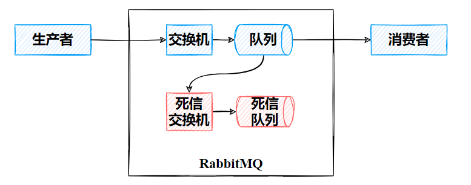

2. 如果当前队列没有指定交换机，这个消息就会被丢弃。

实际上，DLX 本身就是一个普通交换机，我们可以为任意队列指定 DLX，当该队列中存在死信时，RabbitMQ 就会自动的将这个死信投递到 DLX 上去，进而被路由到死信队列中。

~~~java
// 配置死信交换机和死信队列
@Configuration
public class DeadLetterConfig {
    // 正常交换机、队列名称
    public static final String NORMAL_EXCHANGE = "normal_exchange";
    public static final String NORMAL_QUEUE = "normal_queue";
    // 死信交换机、队列名称
    public static final String DL_EXCHANGE = "dl_exchange";
    public static final String DL_QUEUE = "dl_queue";

    // 声明死信的交换机、队列
    @Bean("dlExchange")
    public Exchange dlExchange(){
        return ExchangeBuilder.topicExchange(DL_EXCHANGE).durable(true).build();
    }
    @Bean("dlQueue")
    public Queue dlQueue(){
        return QueueBuilder.durable(DL_QUEUE).build();
    }

    // 声明正常的交换机、队列
    @Bean("normalExchange")
    public Exchange normalExchange(){
        return ExchangeBuilder.topicExchange(NORMAL_EXCHANGE).durable(true).build();
    }
    @Bean("normalQueue")
    public Queue normalQueue(){
        Map<String,Object> params = new HashMap<>();
        // 正常队列绑定死信交换机
        params.put("x-dead-letter-exchange",DL_EXCHANGE); // x-dead-letter-exchange：死信交换机的名称
        params.put("x-dead-letter-routing-key","dl.message"); // x-dead-letter-routing-key：死信交换机的路由键,注意这个key要能够使得死信交换机和死信队列之间绑定的key生效
        params.put("x-message-ttl",10000); // 设置过期时间
        params.put("x-max-length",10); // 设置队列的最大长度
        return QueueBuilder.durable(NORMAL_QUEUE).withArguments(params).build();
        
        /*
         // 下面方式也可以
         return QueueBuilder.durable(NORMAL_QUEUE) // 指定队列名称，并持久化
        	.ttl(10000) // 设置队列的超时时间，10秒
        	.deadLetterExchange(DL_EXCHANGE) // 指定死信交换机
        	.build();
        */
        
    }

    // 正常队列和正常交换机绑定
    @Bean
    public Binding normalQueueExchange(@Qualifier("normalQueue") Queue queue, @Qualifier("normalExchange") Exchange exchange){
        return BindingBuilder.bind(queue).to(exchange).with("normal.#").noargs();
    }

    // 死信队列和死信交换机绑定
    @Bean
    public Binding dlQueueExchange(@Qualifier("dlQueue") Queue queue, @Qualifier("dlExchange") Exchange exchange){
        return BindingBuilder.bind(queue).to(exchange).with("dl.#").noargs();
    }
}
~~~

## 7. 延迟队列

>延迟队列是⼀种带有延迟功能的消息队列， 生产者将消息发送到消息队列服务端，但并不期望这条消息立马投递，而是推迟到在当前时间点之后的某⼀个时间投递到消费者进行消费，该消息即定时消息。

我们经常在业务中需要用到延迟功能，比如：

- 比如在电商交易中，当用户下单后，需要在 30 分钟之内付款，否则订单将被自动取消。
- 在会议预定成功后，会在会议开始前几分钟通知所有预定该会议的用户。
- 用户下单外卖以后，距离超时时间还有 10 分钟时提醒外卖小哥即将超时。
- ...

RabbitMQ默认没有延迟队列，但可以通过以下两种方式实现延迟队列：

- 死信队列 + TTL
- 官方插件 **[rabbitmq-delayed-message-exchange](https://github.com/rabbitmq/rabbitmq-delayed-message-exchange)**

### 7.1 死信队列 + TTL

我们在前面已经介绍过死信队列和 TTL 的概念与用法，通过这两个东西我们可以巧妙的实现延迟队列功能。基本思想是：

- 给一个设置有 TTL 的队列 Q1 指定一个死信交换机 DLX。
- 让一个死信队列 Q2 绑定此死信交换机 DLX。
- 对于Q1，我们不添加任何消费者对其进行消费，那么一旦生产者发送消息投递到 Q1 中后，由于没有消费者进行消费，那么消息一定会超时，从而会被投递到 DLX，从而被投递到 Q2中，我们设置消费者用于对 Q2 进行消费，此时就实现了生产者与消费者之间消息的延迟接收。

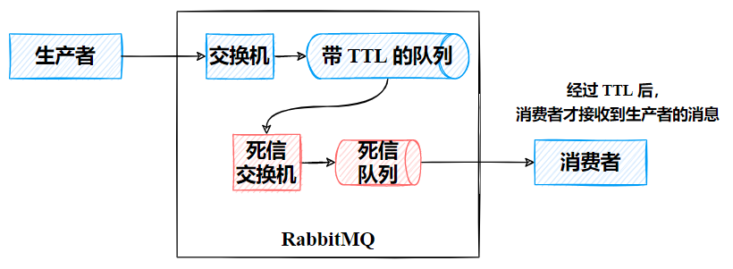

### 7.2  官方插件

因为延迟队列的需求非常多，所以 RabbitMQ 的官方也推出了一个 DelayExchange 插件，用于支持延迟队列效果。通过安装插件，自定义交换机，让交换机拥有延迟发送消息的能力，从而实现延迟消息。

与死信队列 + TTL 实现延迟队列的方式相比：

- 延迟插件方式只需创建一个交换机和一个队列，而死信队列方式需要创建两个交换机（死信队列交换机+处理队列交换机）、两个队列（死信队列+处理队列）。
- 死信队列的方式不需要格外安装任何内容，而延迟插件需要额外下载插件并安装。
- 延迟交换机主要是变更了消息存储的维度到交换机，但是假如消息正在交换机中存储，但是还未路由到队里中，一旦服务宕机，延迟交换机中存储的消息直接就丢失了。只适用于对于数据少量丢失容忍性比较强的业务场景。

延迟插件开源地址为：https://github.com/rabbitmq/rabbitmq-delaed-message-exchange

选择合适的版本，我的 RabbitMQ 版本为3.8.15，那么插件可以选择[3.8.9版本](https://github.com/rabbitmq/rabbitmq-delayed-message-exchange/releases/tag/3.8.9)，然后下载 .ez文件

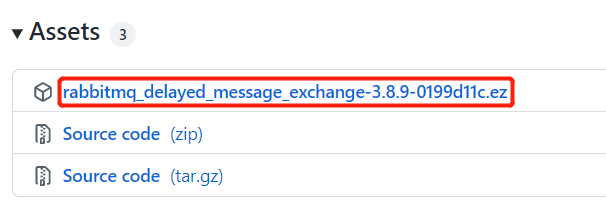

将.ez文件传到服务器，并复制到 docker 容器内部

~~~sh
sudo docker cp rabbitmq_delayed_message_exchange-3.8.9-0199d11c.ez rabbitmq_study:/plugins
# 这里的rabbitmq_study是我的rabbitmq容器的名称（按自己的名称来），也可以用容器id代替
~~~

进入 rabbitmq 容器内部，并启动插件功能

~~~sh
sudo docker exec -it rabbitmq_study /bin/bash
rabbitmq-plugins enable rabbitmq_delayed_message_exchange
~~~

此时我们在 RabbitMQ 的管理页面创建交换机时，就会发现多了一个 `x-delayed-message` 类型。

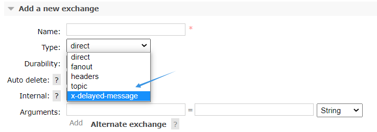

从名称上就可以看出 `rabbitmq-delaed-message-exchange`实际上是针对交换机做的延迟，而不是队列，其原理。当我们发送消息到类型为 `x-delayed-message` 的交换机时，此交换机会有以下处理步骤：

1. 接收消息
2. 判断消息 header 中是否具备 x-delay 属性，如果有 x-delay 属性，说明是延迟消息，则将持久化到硬盘，并读取 x-delay 值，作为延迟时间。如果没有就按正常消息处理。
3. 当 x-delay 时间到期后，再将消息投递到指定队列，实现消息的延迟发送。

~~~java
// 创建延迟交换机
// 方式1：注解的方式，将delayed属性设置为true即可
@RabbitListener(bindings = @QueueBinding(
    value = @Queue(name = "delay.queue", durable = "true"),
    exchange = @Exchange(name = "delay.direct", delayed = "true"),
    key = "delay"
))
public void listenDelayExchange(String msg) {
    log.info("消费者接收到了delay.queue的延迟消息");
}

// 方式2：Bean的方式设置 delayed属性为true即可
@Bean
public Exchange delayedExchange(){
     DirectExchange directExchange = new DirectExchange(RDELAYED_EXCHANGE, true, false);
     directExchange.setDelayed(true);
     return directExchange;
}
~~~

~~~java
// 生产者发送消息，注意需要在请求头中设置消息的延迟时间
Message msg = MessageBuilder.withBody(("hello Delay Exchange").getBytes("UTF-8")).setHeader("x-delay", 10000).build();
~~~

## 8. 消息堆积

>**消息堆积**是指当生产者发送消息的速度大于消费者处理消息的速度，不可避免的会导致队列中消息越来越多，不断堆积，直到队列存储到达上限。

针对于消息堆积，一般的解决方案为：

1. 排查消费者内部逻辑，分析出性能瓶颈（比如消费者可能出现异常宕机了），并且可以采取<u>多线程</u>形式提升消息处理速度。
2. 增加<u>多个消费者</u>，从而增加处理速度。
3. 扩大队列的容量，提升存储上限。
4. 惰性队列。

惰性队列与普通队列的区别：

- **普通队列中的消息会尽可能的存储在内存之中，这样可以更加快速的将消息发送给消费者。**即使是持久化的消息，在被写入磁盘的同时也会在内存中驻留一份备份。当 RabbitMQ 需要释放内存的时候，会将内存中的消息换页至磁盘中，这个操作会耗费较长的时间，也会阻塞队列的操作，进而无法接收新的消息。
- **惰性队列会尽可能的将消息存入磁盘中，而在消费者消费到相应的消息时才会被加载到内存中**。它的一个重要的设计目标是能够支持更长的队列，即支持更多的消息存储。当消费者由于各种各样的原因（比如消费者下线、宕机亦或者是由于维护而关闭等）而致使长时间内不能消费消息造成堆积时，惰性队列就很有必要了。
  - lazy queue 消息不持久化 ， 但是这种模式还是会把消息放到硬盘里，RAM的使用率会一直很稳定，但是重启后一样会丢失消息。
  - lazy queue 消息持久化，这种方式无疑是最佳搭配，消息放到硬盘并且不会因为服务器重启而丢失，面对高并发也是从容不已。
- 惰性队列减少了内存的消耗，但会增加 I/O 的使用，相当于以**空间换时间**，当然惰性队列的发送速度不一定比普通队列慢，尤其在高并发场景下可能比普通队列还快，原因是普通队列会由于内存不足而不得不将消息换页至磁盘。

在队列声明的时候可以通过`x-queue-mode`参数来设置队列的模式，取值为『default』和『lazy』，其中 lazy 就是定义惰性队列。

~~~java
// Springboot 声明队列为LazyQueue

// 方式1
@Bean
public Queue lazyQueue() {
    return QueueBuilder.durable("lazy.queue")
        .lazy()  // 惰性队列
        .build();
}

// 方式2
@RabbitListener(bindings = @QueueBinding(
    value = @Queue(name = "lazy.queue", durable = "true",arguments = @Argument(name = "x-queue-mode",value = "lazy")),
    exchange = @Exchange(name = "lazy.direct"),
    key = "lazy"
))
public void listenLazyQueue(String msg) {
    log.info("消费者接收到了lazy.queue的延迟消息");
}
~~~

## 9. 消费端限流

>在业务高峰时期，可能会出现生产者发送消息的速度远超消费者处理消息的速度的情况，比如双十一时，大量的订单涌入，此时消息队列就会囤积大量的消息，而<u>如果此时消费者一次取出大量的消息， 但是又无法同时处理这么多消息， 就可能导致服务崩溃， 所以需要对消费端进行限流。</u>

RabbitMQ 提供了一种 **qos** （服务质量保证）功能，**在手动确认消息的前提下**，如果指定 Qos 数目的消息没有被确认前，不会消费新的消息。

可以在 springboot 配置类中配置 `prefetch=n`，此值表示消费端每次从 MQ 拉 n 条消息消费，直到手动确认消费完毕后，才会继续拉去下一条消息。比如将 perfetch 设置为1000，那么一次拉 1000 条消息，等待手动确认后，再拉取 1000 条消息，就可以实现消息的削峰限流。

~~~yaml
spring:
  rabbitmq:
    listener:
      simple:
        acknowledge-mode: manual  # 手动确认消息
        prefetch: 1000	# 一次最多取消息的个数
~~~

## 10. 幂等性（消息重复消费）

>  消息的幂等性是指对于同一个系统，在同样条件下，**一次请求和重复多次请求对资源的影响是一致的**，不会因为多次点击而产生了副作用。

生活中常见要求幂等性的场景如：

1. 用户支付时，一笔订单应当只能扣一次钱，无论是网络问题或者其他问题而重新付款，都只应该扣一次钱；
2. 用户在APP上连续点击了多次提交订单，后台应该只产生一个订单；
3. 用户对一篇文章进行点赞，无论点了多少次，最终实际上也能将点赞数+1；
4. 前端重复提交选中的数据，后台也只会产生对应这个数据的一个反应结果。

增删改查的幂等性：

- `Get ` 用于获取资源，不会对系统资源进行改变，因此是幂等的。
- `Delete` 用于删除资源，虽然改变了系统资源，但是第一次和第N次删除操作对系统的作用是相同的，所以是幂等的。比如要删除一个 id 为 1 的资源，可能第一次调用时会删除，而后面所有调用的时候由于系统中已经没有这个 id 的资源了，就无法进行删除了。但是第一次操作和后面的操作对系统的作用是相同的，所以这也是幂等的，调用者可以多次调用这个接口不必担心错误。
- `Post ` 用于新增资源，这意味着每次调用都会在系统中产生新的资源，所以该操作注定不是幂等操作。
- `Put ` 用于修改资源，如果是设置具体值，则是幂等的，比如设置用户张三的分数为98，那么无论修改一次还是多次，最终结果都一样。但如果是增量修改，则可能不是幂等的，比如将用户张三的分数减10，那么多次修改和一次修改的效果是完全不同的。

RabbitMQ 的幂等性问题

- **消息重复投递**。生产者发送消息到 broker后，broker在confirm 确认的时候出现网络故障，使得生产者没收到该消息ACk 而重新发送消息到 broker 中。

-  **消息重复消费**。<u>消费者处理完一条消息后，在向 MQ 发送 ack 确认时出现了网络故障，使得 MQ 没有收到此 ack 确认， 那么 MQ 并不会将该条消息删除，而是重新发送给其他的消费者或者当重新建立起连接后，再次发送给该消费者，这就造成了消息的重复消费。</u>
- 解决了消息重复消费的问题其实就解决了消息重复投递的问题。

解决方案：

- ==全局唯一ID + 唯一索引==

  通过时间戳或者UUID或按自己的规则生成一个全局唯一id，每次消费消息时用该id先判断该消息是否已消费过。比如基于数据库的唯一键来保证重复数据不会重复插入多条。因为有唯一键约束了，重复数据插入只会报错，不会导致数据库中出现脏数据。不过在高并发时，如果是单个数据库就会有写入性能瓶颈（可采用分库分表提升性能）。

- ==Redis原子性==

  利用 redis 执行 setnx 命令，天然具有幂等性。从而实现不重复消费，如果 ack 失败，在 RabbitMQ 将消息交给其他的消费者时，先执行 setnx，如果 key 已经存在（说明之前有人消费过该消息），获取他的值，如果是 0，当前消费者就什么都不做，如果是 1，直接 ack。

## 11. 集群（高可用）

> 使用了 MQ 后，整个系统会依赖于MQ的可靠性、安全性、吞吐能力，比如若MQ宕机，整个系统都会崩溃。因而会降低系统的可用性，那么如何改善这一缺点呢？答案是搭建集群环境。

RabbitMQ的集群有两种模式：

- **普通集群【无高可用】**：是一种分布式集群，将队列分散到集群的各个节点，从而提高整个集群的并发能力。
- **镜像集群【高可用】**：是一种主从集群，普通集群的基础上，添加了主从备份功能，提高集群的数据可用性。

### 11.1 普通集群

普通集群模式是使用多台服务器，在每台服务器中启动一个 RabbitMQ 实例，我们创建的每一个队列 Queue，它的元数据（主要就是 Queue 的一些配置信息）会在所有的 RabbitMQ 实例中进行同步，但是**队列中的消息只会存在于一个 RabbitMQ 实例上**，而不会同步。

当消费者拉取消息时，如果连接到了另外一个实例，那么此实例实际会通过元数据定位到 队列所在的位置，之后访问队列所在的实例，并拉取数据发送给消费者。

可见，这种集群**可以提高 RabbitMQ 的消息吞吐能力，但是无法保证高可用**，因为一旦一个 RabbitMQ 实例挂了，其中的消息就访问不到了，其他实例中并不会保存挂掉的实例中的消息。

- 如果 MQ 做了持久化，那么实例恢复后，才可以继续访问；
- 如果 MQ 没做持久化，那么消息就丢了。

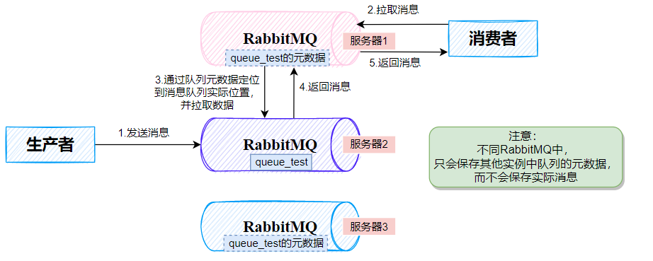

### 11.2 镜像集群

由于普通集群并没有实现 RabbitMQ 的高可用，实际生产条件下一般不会使用，而是会使用镜像集群。

相较于普通集群，**镜像集群会将队列的所有数据（包括实际消息）同时存储在多台机器上，而不是仅仅存储队列的元数据。**每个 RabbitMQ 实例都有一份镜像数据（副本数据）。在每次写入消息的时候都会自动把数据同步到多台实例上去，这样一旦其中一台机器发生故障，其他机器还有一份副本数据可以继续提供服务，也就实现了高可用。

本质上是主从结构，创建队列的节点被称为该队列的**主节点，**备份到的其它节点叫做该队列的**镜像**节点。一旦某个 RabbitMQ 示例挂机了，那么其镜像节点就会成为新的主节点。

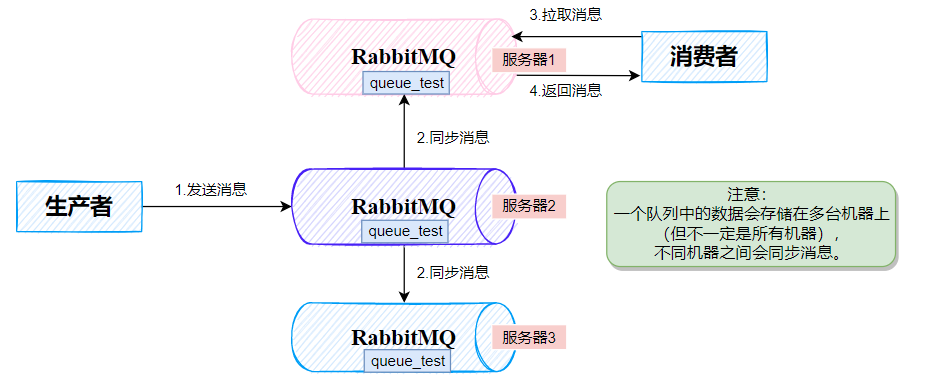

镜像集群模式并不需要额外搭建，只需要我们在普通集群的基础上将队列配置为镜像队列即可。

